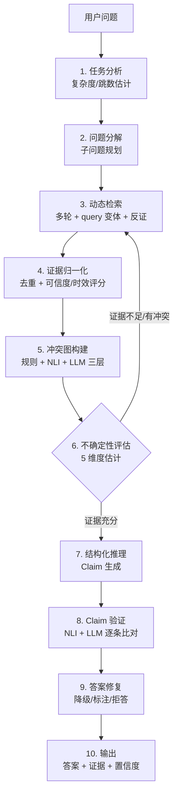

<div align="center">

# VeraRAG

**Verifiable Agentic Retrieval-Augmented Reasoning**

面向复杂知识任务的「可验证」Agentic RAG 推理系统

[](tests/)
[](pyproject.toml)
[](LICENSE)
[](https://github.com/xiaweiyi713/VeraRAG/actions)
[](ruff.toml)

[核心特性](#-核心特性) · [架构](#-系统架构) · [快速开始](#-快速开始) · [VeraBench](#-verabench-基准测试) · [评估指标](#-评估指标) · [路线图](#-路线图)

</div>

---

## 📖 项目简介

**VeraRAG** 是一个能够在 **复杂多跳、证据冲突、信息不完整** 等真实场景下，动态检索、规划推理、检测冲突、估计不确定性、自反思修正，并输出 **每条断言都有据可依** 的 Agentic RAG 系统。

与「一次性 top-k 检索 + 直接生成」的传统 RAG 不同，VeraRAG 把检索与推理建模成一个 **由不确定性驱动的多智能体闭环**：系统会评估当前证据是否足够、是否存在冲突、答案是否可信，并据此决定 **继续检索 / 仲裁冲突 / 修复答案 / 主动拒答**。

> 💡 一句话概括：**让 RAG 不仅会"答"，更会"判断自己答得对不对"。**

### 为什么需要 VeraRAG？

| 传统 RAG 的痛点 | VeraRAG 的应对 |
|----------------|---------------|
| 一次检索定生死，证据不足也硬答 | **动态检索**：按问题分解结果多轮自适应检索 |
| 文档相互矛盾时随机挑一个 | **证据冲突图**：显式建模数值/时间/实体等 10 类冲突并仲裁 |
| 置信度全靠"语气"，无法校准 | **不确定性控制**：5 维度估计 + ECE/Brier 校准 |
| 答案"看起来对"，无法溯源 | **Claim 级验证**：逐条断言比对证据，未支持则修复或拒答 |

---

## ✨ 核心特性

- 🔄 **动态检索规划** —— 根据问题分解结果自适应多轮检索，支持 query 变体生成与反证检索，而非一次性 top-k。
- 🕸️ **三层证据冲突检测** —— 规则层（10 个检测器）+ NLI 层（CrossEncoder）+ LLM 裁决层，显式建模文档间的支持、反驳、数值、时间冲突。
- 📉 **不确定性驱动控制** —— 5 维不确定性估计 + 6 种决策动作（继续检索 / 冲突仲裁 / 答案修复 / 拒答等），由不确定性反向驱动检索策略。
- ✅ **Claim 级结构化验证** —— 答案的每个断言都标注 `verifiable / support_type / claim_type`，逐条对照证据验证，确保可溯源。
- 🧩 **6 种 LLM 后端** —— OpenAI / Anthropic / Ollama / 通义千问 / 智谱 / DeepSeek，统一客户端接口，配置即用。
- 🔍 **5 种检索器** —— BM25 / Dense / FAISS / Hybrid（RRF 融合）+ CrossEncoder 重排序，依赖缺失时自动优雅降级。
- 🌐 **Web UI** —— FastAPI + SSE/WebSocket 流式推理展示、查询历史、证据审计、文件上传、亮暗主题、移动端适配。
- 📊 **VeraBench 基准** —— 自建 152 道标注问题 / 57 篇语料 / 6 种问题类型，覆盖 ~20 项评估指标。

---

## 🏗️ 系统架构

VeraRAG 的核心是一条由 **10 个阶段** 组成的可验证推理流水线，其中 **不确定性评估** 会反向决定是否需要更多检索轮次：



| 阶段 | 模块 | 职责 |
|------|------|------|
| 1 | `TaskAnalyzer` | 规则 + LLM 任务分析，估计复杂度与跳数 |
| 2 | `DecompositionPlanner` | 子问题分解 + 不确定性驱动的计划修正 |
| 3 | `DynamicRetrievalAgent` | 多轮检索、query 变体生成、反证检索、覆盖度评估 |
| 4 | `EvidenceNormalizer` | 语义去重、可信度/时效性评分、质量过滤 |
| 5 | `ConflictGraphBuilder` | **三层架构**：规则(10 检测器) + NLI(CrossEncoder) + LLM 裁决 |
| 6 | `UncertaintyController` | 5 维不确定性估计 → 6 种决策动作，驱动检索 |
| 7 | `ReasoningAgent` | LLM 结构化推理，生成带类型标注的 Claim |
| 8 | `VerifierAgent` | NLI + LLM 的 Claim 级验证、冲突忽略检测 |
| 9 | `RepairAgent` | 过度自信降级、未支持声明修复、冲突注释 |
| 10 | `VeraRAG` Orchestrator | SSE 流式编排、config 驱动的消融开关 |

---

## 🚀 快速开始

### 1. 安装

```bash
# 克隆项目
git clone https://github.com/xiaweiyi713/VeraRAG.git
cd VeraRAG

# 安装依赖（国内镜像加速）
pip install -r requirements.txt -i https://pypi.tuna.tsinghua.edu.cn/simple

# 或使用 conda
conda env create -f environment.yml && conda activate verarag
```

> 要求 **Python 3.10+**。仅安装核心依赖即可运行（BM25 检索可独立工作）；`sentence-transformers` / `faiss-cpu` 为可选，缺失时 Dense/Hybrid/NLI 会自动降级。

### 2. 启动 Web UI

```bash
python run_web.py --port 8000
# 或 make run
```

打开 <http://localhost:8000> 即可使用交互式问答界面：

- **未配置 LLM** → 自动进入 **演示模式**，用真实 BM25 检索 + 模拟推理预览完整流程；
- 点击导航栏「设置」配置 LLM Provider 与 API Key（密钥经 Fernet 加密后本地存储）。

### 3. Python API

```python
from src.pipeline.verarag import VeraRAG

# 方式一：直接传入配置
pipeline = VeraRAG({
    "llm": {
        "provider": "openai",       # openai / anthropic / ollama / dashscope / zhipuai / deepseek
        "model": "gpt-4o-mini",
        "api_key": "sk-xxx",
    }
})

# 方式二：通过环境变量（export OPENAI_API_KEY=sk-xxx）
pipeline = VeraRAG({"llm": {"provider": "openai"}})

# 查询
result = pipeline.query("量子计算目前面临的主要技术挑战是什么？")

print(f"答案:   {result.answer}")
print(f"置信度: {result.confidence:.2f}")
print(f"证据:   {len(result.evidence)} 条")
print(f"冲突:   {result.metadata['num_conflicts']} 个")
print(f"断言:   {len(result.answer_claims)} 条 (每条带 verifiable/support_type 标注)")
```

### 4. 运行基准测试 / 实验

```bash
# VeraBench 评测（demo 模式，无需 API key）
python experiments/run_verabench.py --demo
# 或 make benchmark

# VeraBench 真实评测（需要 LLM API key）
DEEPSEEK_API_KEY=<key> python experiments/run_verabench.py \
    --config configs/model.yaml --output results/verabench_full.json

# 消融实验（7 组）与基线对比（3 种）
python experiments/run_ablation.py --demo    # make ablation
python experiments/run_baselines.py --demo   # make baselines
```

---

## 📊 VeraBench 基准测试

VeraBench 是为评测「可验证推理」专门构建的中文基准，强调 **冲突、时序、不可答** 等真实困难场景。

<div align="center">

| 维度 | 规模 |
|------|------|
| 标注问题 | **152** 道 |
| 语料文档 | **57** 篇（13 主题领域） |
| 问题类型 | **6** 类 |
| 难度分布 | easy 62 / medium 69 / hard 21 |

</div>

每道问题都包含 `ground_truth_answer`、`ground_truth_claims`、`evidence`（证据引用）、`expected_conflicts`、`expected_behavior` 等完整标注。

### 问题类型分布

| 类型 | 数量 | 考查能力 |
|------|------|---------|
| `single_evidence` | 26 | 单证据事实问答 |
| `multi_evidence` | 25 | 多证据综合（多跳） |
| `conflict` | 25 | 证据冲突识别与仲裁 |
| `temporal` | 25 | 时间线推理 |
| `unanswerable` | 26 | 信息不足时主动拒答 |
| `misleading` | 25 | 抵抗误导性/干扰证据 |

---

## 🕸️ 三层冲突检测

VeraRAG 不止"发现"冲突，更对冲突 **分类、定位、仲裁**，采用级联的三层架构（上层无法判定才下沉到更重的下层）：

```
规则层（快，10 个检测器）  →  NLI 层（CrossEncoder 蕴含判断）  →  LLM 裁决层（兜底）
```

规则层覆盖的 10 类冲突检测器：

| 类型 | 说明 | 示例 |
|------|------|------|
| Numeric | 数值差异（含年份过滤、动态阈值） | "错误率 15%" vs "错误率 5%" |
| Temporal | 时间线矛盾 | "2023 年发布" vs "2024 年发布" |
| Entity | 实体不匹配 | "谷歌" vs "IBM" |
| Source | 来源可信度冲突 | 权威机构 vs 个人博客 |
| Scope | 范围差异 | 全球数据 vs 区域数据 |
| Causal | 因果关系分歧 | 原因 A vs 原因 B |
| Definitional | 定义体系冲突 | 不同定义标准 |
| Granularity | 粒度差异 | 概览 vs 详细数据 |
| Support | 证据相互支持关系 | A 支持 B |
| Semantic | 语义矛盾（Jaccard + SequenceMatcher） | 直接否定/对立表述 |

> NLI 层与 LLM 裁决层为可选增强，未安装 `sentence-transformers` 或未配置 LLM 时自动降级为纯规则检测。

---

## 📏 评估指标

内置 5 个评估模块、约 20 项指标，全面覆盖答案、证据、冲突、校准与幻觉：

| 维度 | 指标 |
|------|------|
| **答案质量** | Exact Match、F1、Soft-F1（关键词/数字重叠，适配中文）、Joint EM |
| **证据质量** | Evidence Precision / Recall / F1、Citation Precision / Recall、Supporting Fact |
| **冲突检测** | Detection F1、Type Accuracy、Resolution Accuracy |
| **不确定性校准** | ECE、Brier Score、AUROC |
| **幻觉率** | Unsupported Claim Rate、Entity / Numerical Hallucination Rate |

---

## 📈 实测结果

下表为 VeraRAG **完整流水线**在全部 152 道 VeraBench 问题上的真实评测（非演示模式）。

> **复现配置**：LLM `deepseek-v4-flash`（temperature 0，max_tokens 4000）；检索 Hybrid（BM25 + bge 向量，RRF 融合）+ CrossEncoder 重排序；冲突检测三层（规则 + nli-distilroberta NLI + LLM 裁决）；`max_retrieval_rounds=1`；全流程开启（冲突图 / 不确定性 / 验证 / 修复）。152 题零错误，平均 ~62s/题。
>
> 复现命令：`DEEPSEEK_API_KEY=<key> python experiments/run_verabench.py --config configs/deepseek_run.yaml --output results/verabench_full.json`

### 行为对齐修复（前后对比）

首轮真实评测暴露出明显的「**倾向作答**」偏差：系统几乎对所有问题都直接作答，不可答题该拒答却硬答、冲突题不标注、误导题不纠正。我们重写了推理 Agent 的行为决策逻辑（证据不足→显式拒答、断言前提不成立→纠正前提、多源冲突→标注冲突），并修复了会用英文模板覆盖答案的修复 Agent。**总体行为准确率 0.526 → 0.763（+0.237）**：

| 问题类型 | 修复前 | 修复后 | |
|----------|:------:|:------:|---|
| 不可答 (unanswerable) | 0.077 | **0.962** | 🔼 该拒答时能拒答 |
| 误导 (misleading) | 0.080 | **0.760** | 🔼 能纠正错误前提 |
| 冲突 (conflict) | 0.080 | **0.480** | 🔼 能标注证据冲突 |
| 单证据 (single_evidence) | 1.000 | **1.000** | ✅ 未受影响 |
| 时序 (temporal) | 1.000 | 0.760 | ⚠️ 略降（见下） |
| 多证据 (multi_evidence) | 0.920 | 0.600 | ⚠️ 略降（见下） |

**当前总体指标（修复后）**

| 指标 | 数值 | 说明 |
|------|------|------|
| **Behavior Accuracy** | **0.763** | 行为是否符合预期（作答/拒答/标注冲突/纠正前提） |
| Answer F1 (soft) | 0.281 | 自由生成的中文答案，软 F1 天然偏低；EM≈0 属正常 |
| **Evidence Recall** | **0.799** | 检索证据能稳定覆盖 gold 证据（可溯源性强） |
| Evidence Precision | 0.156 | top-10 检索带入较多非 gold chunk，精确率偏低 |
| Conflict Detection F1 | 0.007 | 冲突边与 gold 对齐仍弱（主要短板） |
| ECE / Brier | 0.416 / 0.416 | **校准退化**：准确率提升后置信度仍偏低（均值 0.16），呈过度不自信，待重新校准 |

**按问题类型（修复后）**

| 类型 | 数量 | Answer F1 | Evidence Recall | Behavior Acc |
|------|------|-----------|-----------------|--------------|
| single_evidence | 26 | 0.331 | **1.000** | **1.000** |
| multi_evidence | 25 | 0.262 | 0.713 | 0.600 |
| temporal | 25 | 0.330 | 0.640 | 0.760 |
| conflict | 25 | 0.256 | 0.720 | 0.480 |
| unanswerable | 26 | 0.324 | 0.846 | **0.962** |
| misleading | 25 | 0.181 | 0.867 | 0.760 |

**结果解读（如实）**

- ✅ **优势**：证据检索与溯源可靠（整体 Recall ≈0.80，单证据题达 1.0）；经行为修复后，**不可答 / 误导 / 冲突** 三类从 ~0.08 大幅提升到 0.48–0.96，系统真正具备了「该拒答时拒答、该标注冲突时标注」的能力。
- ⚠️ **遗留取舍**：让系统愿意拒答 / 标注，代价是 **多证据、时序** 类略低于修复前（部分覆盖证据的开放问题偶尔仍偏保守）；**冲突 F1** 偏低（冲突图过度检测）；**校准退化**（置信度估计需随准确率提升而重新标定）。
- 🎯 **后续方向**：细化「部分证据→作答」与「无关证据→拒答」的边界、降低冲突图误报、对置信度做 temperature scaling 重标定。

> 说明：这是单模型、单配置下经一轮行为对齐迭代的真实数字（baseline / v2 / v3 三版结果均保存在 `results/`），旨在如实反映系统能力与取舍，而非追求最优。

---

## 🗂️ 项目结构

```
VeraRAG/
├── src/                      # 核心源码（~7,800 行）
│   ├── agents/               # 6 个 Agent：分析/分解/检索/推理/验证/修复
│   ├── retriever/            # 5 种检索器：BM25/Dense/FAISS/Hybrid/Reranker
│   ├── evidence/             # 证据处理：提取/归一化/冲突图/评分
│   ├── uncertainty/          # 不确定性：估计/校准/控制器
│   ├── evaluation/           # 评估指标：5 模块 ~20 指标
│   ├── ingestion/            # 文档导入：加载/分块/索引
│   ├── benchmark/            # VeraBench loader / evaluator
│   └── pipeline/             # 主流程编排（SSE streaming）
├── web/                      # Web UI（~1,800 行）
│   ├── api.py                # SSE/WS + 演示 + BM25 检索端点
│   ├── app.py                # FastAPI 应用
│   ├── db.py                 # SQLite 历史 + API Key 加密
│   └── templates/ static/    # Jinja2 模板 + 前端资源
├── data/verabench/           # VeraBench 数据集
│   ├── corpus.jsonl          # 57 篇语料
│   └── questions.jsonl       # 152 道标注问题
├── experiments/              # 实验脚本
│   ├── run_verabench.py      # VeraBench 评测
│   ├── run_ablation.py       # 消融实验（7 组）
│   ├── run_baselines.py      # 基线对比（3 种）
│   ├── calibration_curve.py  # 校准曲线
│   └── baselines/            # Vanilla / Hybrid / Self-RAG
├── tests/                    # 测试（17 文件 / 185 用例 / ~2,800 行）
├── configs/                  # 模型与数据集配置
├── scripts/                  # 索引构建/数据下载/难度验证
└── paper/                    # 论文素材（图表）
```

---

## ⚙️ 配置说明

LLM 配置优先级：**Web UI 配置 > config yaml > 环境变量 > 默认值**。

```yaml
# configs/model.yaml
llm:
  provider: "deepseek"        # openai / anthropic / ollama / dashscope / zhipuai / deepseek
  model: "deepseek-v4-flash"
  api_key: ${DEEPSEEK_API_KEY}  # 支持 ${ENV_VAR} 形式从环境变量展开
  temperature: 0.0
  max_tokens: 500

pipeline:
  max_retrieval_rounds: 2     # 最大检索轮数
  enable_conflict_graph: true # 冲突图（可作为消融开关）
  enable_uncertainty: true    # 不确定性控制
  enable_verification: true   # Claim 验证
  enable_repair: true         # 答案修复
```

---

## 🧪 测试与质量

```bash
# 全量单元测试（无需 API key，182 passed + 3 skipped）
python -m pytest tests/ -q          # make test

# 覆盖率报告
make coverage

# Lint + 类型检查（ruff + mypy）
make lint

# 真实 LLM 端到端测试（可选）
OPENAI_API_KEY=sk-xxx RUN_REAL_LLM_TESTS=1 python -m pytest tests/test_e2e_real_llm.py -v
```

- ✅ **185 个测试**（182 passed + 3 个真实 LLM 测试默认跳过）
- ✅ **GitHub Actions CI**：Python 3.10 / 3.11 / 3.12 矩阵
- ✅ `ruff` 代码风格 + `mypy` 类型检查

---

## 🐳 Docker 部署

```bash
make docker-build      # 构建镜像
make docker-run        # 运行（映射 8000 端口 + 挂载 data/）
```

---

## 🗺️ 路线图

- [x] 跑完整 152 题 VeraBench 真实评测（DeepSeek，见[实测结果](#-实测结果)）
- [x] **修复「倾向作答」偏差**：证据不足→拒答、前提不成立→纠正、多源→标注冲突（行为准确率 0.526→0.763）
- [ ] 置信度重新校准（修复后 ECE 退化），并降低冲突图误报以提升 Conflict-F1
- [ ] 细化「部分证据→作答 vs 无关→拒答」边界，回补多证据 / 时序类
- [ ] 真实 LLM 下的基线对比与 7 组消融实验数据
- [ ] VeraBench 扩展至 300+ 题，补充 hard 难度与新领域
- [ ] 多轮对话、英文 VeraBench 子集、Agent 路由优化

> 详细开发进度见 [DEV_PROGRESS.md](DEV_PROGRESS.md)。

---

## 🤝 贡献

欢迎提交 Issue 与 Pull Request！提交前请确保 `make test` 与 `make lint` 通过。

## 📄 许可证

本项目基于 [MIT License](LICENSE) 开源。
