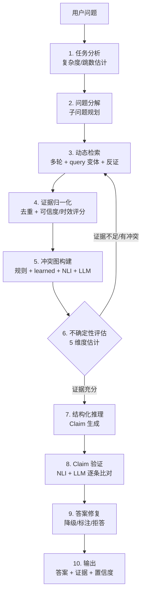

<div align="center">

# VeraRAG

**Verifiable Agentic Retrieval-Augmented Reasoning**

面向复杂知识任务的「可验证」Agentic RAG 推理系统

[](tests/)
[](pyproject.toml)
[](LICENSE)
[](https://github.com/xiaweiyi713/VeraRAG/actions)
[](ruff.toml)

[核心特性](#-核心特性) · [架构](#-系统架构) · [快速开始](#-快速开始) · [API](docs/API.md) · [评测](docs/EVALUATION.md) · [GPU训练](docs/GPU_TRAINING.md) · [贡献](#-贡献)

</div>

---

## 📖 项目简介

**VeraRAG** 是一个能够在 **复杂多跳、证据冲突、信息不完整** 等真实场景下，动态检索、规划推理、检测冲突、估计不确定性、自反思修正，并输出 **每条断言都有据可依** 的 Agentic RAG 系统。

与「一次性 top-k 检索 + 直接生成」的传统 RAG 不同，VeraRAG 把检索与推理建模成一个 **由不确定性驱动的多智能体闭环**：系统会评估当前证据是否足够、是否存在冲突、答案是否可信，并据此决定 **继续检索 / 仲裁冲突 / 修复答案 / 主动拒答**。

> 💡 一句话概括：**让 RAG 不仅会"答"，更会"判断自己答得对不对"。**

### 为什么需要 VeraRAG？

| 传统 RAG 的痛点 | VeraRAG 的应对 |
|----------------|---------------|
| 一次检索定生死，证据不足也硬答 | **动态检索**：按问题分解结果多轮自适应检索 |
| 文档相互矛盾时随机挑一个 | **证据冲突图**：显式建模数值/时间/实体等 10 类冲突并仲裁 |
| 置信度全靠"语气"，无法校准 | **不确定性控制**：5 维度估计 + ECE/Brier 校准 |
| 答案"看起来对"，无法溯源 | **Claim 级验证**：逐条断言比对证据，未支持则修复或拒答 |

---

## ✨ 核心特性

- 🔄 **动态检索规划** —— 根据问题分解结果自适应多轮检索，支持 query 变体生成与反证检索，而非一次性 top-k。
- 🕸️ **分层证据冲突检测** —— 规则层（10 个检测器）+ 可训练 CrossEncoder + NLI 层 + LLM 裁决层，显式建模文档间的支持、反驳、数值、时间冲突。
- 📉 **不确定性驱动控制** —— 5 维不确定性估计 + 6 种决策动作（继续检索 / 冲突仲裁 / 答案修复 / 拒答等），由不确定性反向驱动检索策略。
- ✅ **Claim 级结构化验证** —— 答案的每个断言都标注 `verifiable / support_type / claim_type`，逐条对照证据验证，确保可溯源。
- 🧩 **6 种 LLM 后端** —— OpenAI / Anthropic / Ollama / 通义千问 / 智谱 / DeepSeek，统一客户端接口，配置即用。
- 🔍 **5 种检索器** —— BM25 / Dense / FAISS / Hybrid（RRF 融合）+ CrossEncoder 重排序，依赖缺失时自动优雅降级。
- 🌐 **Web UI** —— FastAPI + SSE/WebSocket 流式推理展示、查询历史、证据审计、文件上传、亮暗主题、移动端适配。
- 📊 **VeraBench 基准** —— 自建 152 道标注问题 / 57 篇语料 / 6 种问题类型，覆盖 ~20 项评估指标。

---

## 🏗️ 系统架构

VeraRAG 的核心是一条由 **10 个阶段** 组成的可验证推理流水线，其中 **不确定性评估** 会反向决定是否需要更多检索轮次：



| 阶段 | 模块 | 职责 |
|------|------|------|
| 1 | `TaskAnalyzer` | 规则 + LLM 任务分析，估计复杂度与跳数 |
| 2 | `DecompositionPlanner` | 子问题分解 + 不确定性驱动的计划修正 |
| 3 | `DynamicRetrievalAgent` | 多轮检索、query 变体生成、反证检索、覆盖度评估 |
| 4 | `EvidenceNormalizer` | 语义去重、可信度/时效性评分、质量过滤 |
| 5 | `ConflictGraphBuilder` | **分层架构**：规则(10 检测器) + 可训练 CrossEncoder + NLI + LLM 裁决 |
| 6 | `UncertaintyController` | 5 维不确定性估计 → 6 种决策动作，驱动检索 |
| 7 | `ReasoningAgent` | LLM 结构化推理，生成带类型标注的 Claim |
| 8 | `VerifierAgent` | NLI + LLM 的 Claim 级验证、冲突忽略检测 |
| 9 | `RepairAgent` | 过度自信降级、未支持声明修复、冲突注释 |
| 10 | `VeraRAG` Orchestrator | SSE 流式编排、config 驱动的消融开关 |

---

## 🚀 快速开始

### 1. 安装

```bash
# 克隆项目
git clone https://github.com/xiaweiyi713/VeraRAG.git
cd VeraRAG

# 安装依赖（国内镜像加速）
pip install -r requirements.txt -i https://pypi.tuna.tsinghua.edu.cn/simple

# 或使用 conda
conda env create -f environment.yml && conda activate verarag

# 本机环境诊断（不会输出 API key）
python experiments/doctor.py
# 安装 editable/package 后也可用
verarag-doctor --json
```

> 要求 **Python 3.10+**。仅安装核心依赖即可运行（BM25 检索可独立工作）；`sentence-transformers` / `faiss-cpu` 为可选，缺失时 Dense/Hybrid/NLI 会自动降级。

### 2. 启动 Web UI

```bash
python run_web.py --port 8000
# 或 make run
# 安装包后可直接使用
verarag-web --port 8000
```

打开 <http://localhost:8000> 即可使用交互式问答界面：

- **未配置 LLM** → 自动进入 **演示模式**，用真实 BM25 检索 + 模拟推理预览完整流程；
- 点击导航栏「设置」配置 LLM Provider 与 API Key（密钥经 Fernet 加密后本地存储）。

### 3. Python API

完整 API 参考见 [docs/API.md](docs/API.md)，架构设计说明见 [docs/ARCHITECTURE.md](docs/ARCHITECTURE.md)。安装后可先运行无需 API key 的示例：

```bash
python examples/quickstart.py
```

```python
from verarag import VeraRAG

# 方式一：直接传入配置
pipeline = VeraRAG({
    "llm": {
        "provider": "openai",       # openai / anthropic / ollama / dashscope / zhipuai / deepseek
        "model": "gpt-4o-mini",
        "api_key": "sk-xxx",
    }
})

# 方式二：通过环境变量（export OPENAI_API_KEY=sk-xxx）
pipeline = VeraRAG({"llm": {"provider": "openai"}})

# 查询
result = pipeline.query("量子计算目前面临的主要技术挑战是什么？")

print(f"答案:   {result.answer}")
print(f"置信度: {result.confidence:.2f}")
print(f"证据:   {len(result.evidence)} 条")
print(f"冲突:   {result.metadata['num_conflicts']} 个")
print(f"断言:   {len(result.answer_claims)} 条 (每条带 verifiable/support_type 标注)")
```

### 4. 运行基准测试 / 实验

```bash
# VeraBench 评测（demo 模式，无需 API key）
python experiments/run_verabench.py --demo
# 或 make benchmark / verarag-benchmark --demo
# demo 是完整 gold-vs-gold 管线自检，不代表任何模型质量

# 校验 VeraBench v1.1.2 结构、证据可追溯性与仓库/包内数据指纹
python experiments/validate_verabench.py
# 或 verarag-validate-benchmark

# 针对本地参考语料做 benchmark 文本污染/近重复审计
python experiments/audit_verabench_contamination.py \
    --reference /path/to/local/training-or-public-corpus \
    --containment-threshold 0.85 \
    --output outputs/verabench_contamination_audit.json
# 或 verarag-audit-contamination ...

# 扫描仓库中误提交的高置信度 API key / token
python experiments/scan_secrets.py
# 或 make security / verarag-scan-secrets

# 本机额外扫描被 .gitignore 忽略的 .env.local 等文件
python experiments/scan_secrets.py --include-ignored
# 或 make security-local / verarag-scan-secrets --include-ignored

# 校验独立外部冲突集的 manifest、双人标注、仲裁 gold、指纹与 Cohen's kappa
python experiments/build_external_annotation_packet.py \
    --data-dir data/external/conflict_mini_v1 \
    --output-dir outputs/conflict_mini_packet \
    --annotator ann_a \
    --annotator ann_b
# 或 verarag-build-external-annotation-packet ...

# 标注者完成模板后，编译成审计目录
python experiments/compile_external_annotations.py \
    --packet-dir outputs/conflict_mini_packet \
    --output-dir outputs/conflict_mini_compiled
# 或 verarag-compile-external-annotations ...

python experiments/validate_external_conflict_set.py \
    --data-dir outputs/conflict_mini_compiled \
    --min-questions 6
# 或 verarag-validate-external-conflicts --data-dir outputs/conflict_mini_compiled --min-questions 6

# VeraBench 真实评测（需要 LLM API key）
DEEPSEEK_API_KEY=<key> python experiments/run_verabench.py \
    --config configs/model.yaml --output results/verabench_full.json
# 安装包后也可使用：
DEEPSEEK_API_KEY=<key> verarag-benchmark \
    --config configs/model.yaml --output results/verabench_full.json

# 评测模式必须显式选择 --demo 或 --config，二者互斥。
# 真实配置加载失败会立即非零退出，绝不会静默降级为 demo 成绩。

# 精确复测指定问题（用于失败样例回归）
DEEPSEEK_API_KEY=<key> python experiments/run_verabench.py \
    --config configs/verabench_v112_canonical.yaml \
    --ids V036 V048 V084 \
    --output results/verabench_targeted_failures.json \
    --restart

# Windows GPU detached run with safer key handling:
# prompts for the key, injects it through SSH/FIFO into tmux, and writes output remotely
scripts/start_windows_verabench_eval.sh

# 查看 Windows GPU 训练/评测状态（tmux、GPU、磁盘、最新产物）
scripts/windows_gpu_status.sh
# 或 make gpu-status

# 离线分析已有评测结果（无需 API key）
python experiments/analyze_verabench_results.py results/verabench_full.json
# 或 verarag-analyze results/verabench_full.json

# 指标实现升级后离线重评分，无需再次调用 LLM
python experiments/rescore_verabench.py results/verabench_full.json \
    --output results/verabench_full_rescored.json
# 或 verarag-rescore ...
# 默认要求源报告 benchmark 版本及语料/问题指纹与当前数据完全一致。
# 跨版本仅可显式加 --allow-benchmark-mismatch 做历史敏感性分析，
# 缺少来源元数据的旧报告仅可显式加 --allow-unverified。

# 对两个覆盖相同题目的兼容报告做配对统计比较
python experiments/compare_verabench_reports.py \
    results/baseline.json results/candidate.json \
    --output results/paired_comparison.md
# 或 verarag-compare-reports ...

# 合并并校验互不重叠的并行评测分区，随后自动离线重评分
python experiments/merge_verabench_reports.py \
    results/part-a.json results/part-b.json \
    --require-complete --output results/verabench_full.json
# 或 verarag-merge-reports ...

# 生成校准曲线 SVG（无需 API key）
python experiments/calibration_curve.py \
    --input results/verabench_full.json \
    --correctness-field correct \
    --output results/calibration_curve.svg \
    --json-output results/calibration_curve.json
# 或 verarag-calibration --input results/verabench_full.json --correctness-field correct --output results/calibration_curve.svg

# 离线诊断置信度区分力、risk-coverage 与校准根因（无需 API key）
python experiments/analyze_verabench_results.py results/verabench_full.json \
    --risk-coverage-svg results/risk_coverage.svg \
    --risk-coverage-csv results/risk_coverage.csv \
    --json
# 或 verarag-analyze results/verabench_full.json --json

# 在 held-out split 上做后验 Platt/temperature 校准，输出校准后的报告副本
python experiments/calibrate_verabench_confidence.py \
    --input results/verabench_full.json \
    --output results/verabench_full_calibrated.json \
    --summary-output results/verabench_full_calibration_summary.json \
    --method platt \
    --group-field actual_behavior \
    --json
# 或 verarag-calibrate-report --input results/verabench_full.json --output results/verabench_full_calibrated.json --method platt --group-field actual_behavior

# 生成可提交的结果榜单 / 复现实验摘要
python experiments/build_verabench_leaderboard.py \
    results/verabench_full.json results/verabench_full_v2.json results/verabench_full_v3.json \
    --allow-unverified \
    --allow-mixed-benchmarks \
    --output docs/RESULTS.md
# 或 verarag-leaderboard results/verabench_full_v3.json --output docs/RESULTS.md

# 正式榜单默认拒绝 demo、未完成、缺少复现元数据或 benchmark/metric
# 指纹不一致的报告。上述 allow-* 仅用于显式标注的历史结果整理。

# 构建无共享证据泄漏的冲突检测训练数据
python experiments/build_conflict_training_data.py \
    --output-dir outputs/conflict_pairs_v112_leakfree
python experiments/train_conflict_cross_encoder.py \
    --train outputs/conflict_pairs_v112_leakfree/train.jsonl \
    --val outputs/conflict_pairs_v112_leakfree/val.jsonl \
    --test outputs/conflict_pairs_v112_leakfree/test.jsonl \
    --warmup-steps 10 \
    --dry-run

# 只在未见过的共享证据组上对比 rules-only vs rules+learned
python experiments/compare_conflict_detectors.py \
    --split test \
    --learned-model-path outputs/conflict_cross_encoder_v112_leakfree_seed13 \
    --learned-threshold 0.336213

# 当前三种子 test F1 均值仅 0.211，且 held-out pipeline A/B 无增益；
# learned detector 保持默认关闭，不应在离线 held-out 改善前消耗 LLM 预算。

# 机器执行的模型晋级审计；默认要求独立外部测试集、多种子稳定性、
# 依赖组稳健区间和 rules+learned 的真实增益
python experiments/audit_conflict_model.py \
    --runs outputs/conflict_cross_encoder_v112_leakfree_seed13 \
           outputs/conflict_cross_encoder_v112_leakfree_seed17 \
           outputs/conflict_cross_encoder_v112_leakfree_seed23 \
    --ablation outputs/conflict_detector_external_test.json \
    --output outputs/conflict_model_promotion_audit.json \
    --report-only

# 完整 pipeline A/B 计划工具（仅在离线 detector 先证明增益后使用）
python experiments/run_conflict_ablation.py \
    --config configs/verabench_v112_canonical.yaml \
    --learned-model-path outputs/conflict_cross_encoder_v112_leakfree_seed13 \
    --types conflict misleading \
    --max 10 \
    --plan-only

# 完整 Windows GPU 流程与 training_metrics.json 说明见 docs/GPU_TRAINING.md

# 离线检索消融基线（不调用 LLM）
python experiments/evaluate_retrieval.py \
    --retriever bm25 \
    --top-k 10 \
    --sweep-top-k 1 2 3 4 5 6 8 10 \
    --output outputs/retrieval_eval_bm25_top10.json
# 或 verarag-evaluate-retrieval --retriever bm25 --top-k 10 --output outputs/retrieval_eval_bm25_top10.json

# 离线检索消融矩阵（不调用 LLM；dense/hybrid/reranker 默认只使用本机缓存模型）
python experiments/evaluate_retrieval.py \
    --matrix \
    --matrix-retrievers bm25 bm25_rerank hybrid dense \
    --matrix-dense-models BAAI/bge-base-en-v1.5 sentence-transformers/paraphrase-multilingual-MiniLM-L12-v2 \
    --matrix-top-k 3 5 10 \
    --matrix-policies fixed precision_cap complexity_adaptive \
    --output outputs/retrieval_matrix_v112.json

# 离线 top-k 策略前沿：BM25+Reranker top-3 + complexity_adaptive + BM25 recall anchor
# 当前 macro P/R/F1 = 0.4478/0.9342/0.5916；不加 anchor 为 0.4456/0.9320/0.5893；
# 无 reranker 的 BM25 top-3 + complexity_adaptive 为 0.4365/0.9138/0.5771。
python experiments/evaluate_retrieval.py \
    --retriever bm25_rerank \
    --top-k 3 \
    --top-k-policy complexity_adaptive \
    --reranker-candidate-k 5 \
    --reranker-preserve-base-top-k 1 \
    --reranker-allow-download

# 端到端 pipeline 中可通过 bm25_rerank + retriever.retrieval_top_k + top_k_policy 显式启用；
# canonical v1.1.2 配置仍保持 fixed/depth-10，直到端到端消融证明无行为回退。
# 下一轮 recall-guarded 候选配置：configs/verabench_v112_retrieval_rerank_top3_guarded.yaml
python experiments/plan_retrieval_ablation.py --restart \
    --output outputs/remote_results/verabench_v112_retrieval_ablation_plan.json
# 或 verarag-plan-retrieval-ablation --restart --output outputs/remote_results/verabench_v112_retrieval_ablation_plan.json

# 消融实验（7 组）与基线对比（3 种）
python experiments/run_ablation.py --demo    # make ablation
python experiments/run_baselines.py --demo   # make baselines
```

---

## 📊 VeraBench 基准测试

VeraBench v1.1.2 是为评测「可验证推理」专门构建的中文基准，强调 **冲突、时序、不可答与误导前提纠正** 等真实困难场景。v1.1 将“证据之间互相矛盾”和“证据共同反驳用户前提”分离；v1.1.1 澄清 V084 的时间口径；v1.1.2 进一步保证全部 208 条 evidence ref 都能连续或按省略号分段、按顺序定位回语料原文。

<div align="center">

| 维度 | 规模 |
|------|------|
| 标注问题 | **152** 道 |
| 语料文档 | **57** 篇（13 主题领域） |
| 问题类型 | **6** 类 |
| 难度分布 | easy 59 / medium 77 / hard 16 |

</div>

每道问题都包含 `ground_truth_answer`、`ground_truth_claims`、`evidence`（证据引用）、`expected_conflicts`、`expected_behavior` 等完整标注。

### 问题类型分布

| 类型 | 数量 | 考查能力 |
|------|------|---------|
| `single_evidence` | 27 | 单证据事实问答 |
| `multi_evidence` | 26 | 多证据综合（多跳） |
| `conflict` | 11 | 证据之间真实冲突的识别与仲裁 |
| `temporal` | 25 | 时间线推理 |
| `unanswerable` | 26 | 信息不足时主动拒答 |
| `misleading` | 37 | 纠正错误前提与过度推断 |

当前数据指纹可由 `verarag-validate-benchmark` 复核。完整 SHA-256 会写入每次评测报告的 `metadata.benchmark.fingerprints`。
验证报告还公开 27 个由共享 gold 文档形成的证据依赖组、组大小、文档复用率和近重复题对，避免把 152 题误解为 152 个完全独立样本。
数据构建方式、适用范围、来源性质与已知局限见
[VeraBench Dataset Card](docs/VERABENCH_CARD.md)。

每份新报告同时包含固定种子的按题型分层 bootstrap 区间和按共享证据
连通组重采样的 dependency-robust 敏感性区间。两个系统的差异应使用
`verarag-compare-reports` 同时检查逐题配对结果和共享证据组稳健结果，
而不是仅比较两个点估计。

---

## 🕸️ 分层冲突检测

VeraRAG 不止"发现"冲突，更对冲突 **分类、定位、仲裁**，采用级联的分层架构（上层无法判定才下沉到更重的下层）：

```
规则层（快，10 个检测器）  →  Learned CrossEncoder（VeraBench 微调）  →  NLI 层  →  LLM 裁决层（兜底）
```

规则层覆盖的 10 类冲突检测器：

| 类型 | 说明 | 示例 |
|------|------|------|
| Numeric | 数值差异（含年份过滤、动态阈值） | "错误率 15%" vs "错误率 5%" |
| Temporal | 时间线矛盾 | "2023 年发布" vs "2024 年发布" |
| Entity | 实体不匹配 | "谷歌" vs "IBM" |
| Source | 来源可信度冲突 | 权威机构 vs 个人博客 |
| Scope | 范围差异 | 全球数据 vs 区域数据 |
| Causal | 因果关系分歧 | 原因 A vs 原因 B |
| Definitional | 定义体系冲突 | 不同定义标准 |
| Granularity | 粒度差异 | 概览 vs 详细数据 |
| Support | 证据相互支持关系 | A 支持 B |
| Semantic | 语义矛盾（Jaccard + SequenceMatcher） | 直接否定/对立表述 |

> Learned / NLI / LLM 层均为可选增强，未配置训练模型、未安装 `sentence-transformers` 或未配置 LLM 时自动降级为纯规则检测。

---

## 📏 评估指标

内置 5 个评估模块、约 20 项指标，全面覆盖答案、证据、冲突、校准与幻觉。中文答案采用版本化 `soft-f1-v2`（规范化包含匹配 + 数字/英文 token + 中文 bigram），报告会记录 `metadata.metric_versions`：

| 维度 | 指标 |
|------|------|
| **答案质量** | Exact Match、F1、Soft-F1（关键词/数字重叠，适配中文）、Joint EM |
| **证据质量** | Evidence Precision / Recall / F1、Citation Precision / Recall、Supporting Fact |
| **冲突检测** | Detection F1、Type Accuracy、Resolution Accuracy |
| **不确定性校准** | ECE、Brier Score、AUROC |
| **幻觉率** | Unsupported Claim Rate、Entity / Numerical Hallucination Rate |

---

## 📈 实测结果

### VeraBench v1.1.2 权威全量真实评测

当前仓库数据为 **VeraBench v1.1.2**。权威全量评测使用 `configs/verabench_v112_canonical.yaml`，输出路径为 `outputs/remote_results/verabench_v112_canonical_deepseek.json`；该配置锁定 `deepseek-v4-flash`、temperature `0.0`、`max_tokens=4000`、BM25 检索、`max_retrieval_rounds=1`、全流程开关和 bootstrap seed `1729`。本次运行覆盖 **152/152** 题且 **0 errors**，带 question-stratified bootstrap CI、shared-evidence-cluster sensitivity CI、benchmark 指纹和 run signature。

| 指标 | 数值 |
|------|-----:|
| **Behavior Accuracy** | **0.993** |
| **Evidence Recall** | **0.949** |
| Evidence Precision | 0.124 |
| Answer F1 (`soft-f1-v2`) | 0.403 |
| Conflict micro-F1 | **0.538** |
| Conflict P / R | 0.378 / 0.933 |
| Premise-refutation P / R | **0.889 / 0.952** |
| Citation F1 / Supporting-fact F1 | 0.049 / 0.735 |
| ECE / Brier | 0.474 / 0.356 |
| Avg latency | 168.5s / question |

95% stratified CI：Behavior Accuracy `[0.980, 1.000]`，Answer F1 `[0.371, 0.435]`，Evidence Recall `[0.925, 0.970]`，Evidence Precision `[0.117, 0.133]`，Conflict micro-F1 `[0.409, 0.657]`。按题型看，单证据、多证据、冲突、时序和不可答题行为准确率均为 **1.000**，misleading 为 **0.973**。当前短板很清晰：检索 precision 低、citation 近乎未显式输出、冲突图过度检测（TP/FP/FN `14/23/1`）。

Stage-3 BM25+Reranker top-3 adaptive 全量 A/B 已完成：Evidence Precision `0.124→0.493`（delta `+0.3690`, 95% CI `[+0.3439, +0.3947]`），平均延迟 `168.47s→17.57s`，但 Evidence Recall `0.949→0.883`、Citation F1 `0.049→0.007`、Brier `0.356→0.397`。因此它是 precision-first 候选，不替换 canonical 默认配置；首版 recall/citation guard 已补，仍需 selective fallback 后再跑 guarded full A/B。

Recall/citation guard 已进入候选链路：`reranker_preserve_base_top_k=1` 保留 BM25 anchor，`reasoning_enforce_answer_citations=true` 让答案显式同步 claim-level 证据。3 题 DeepSeek smoke 中 Citation F1 `0→0.889`、Evidence Precision `0.167→0.833`、Recall/Behavior 保持 `1.0`，但 Answer F1、Brier、Supporting-Fact F1 和相对 unguarded 的 Conflict F1 仍有回退；下一步先做 selective fallback / conflict-pair pruning，再跑 152 题 guarded full A/B。

### 历史 VeraBench v1.0 评测

下方历史表为 VeraRAG 在 **VeraBench v1.0** 上的完整真实评测。由于 v1.1 修正了题型本体、gold conflict 与难度标注，且答案/行为/冲突指标均已版本化，旧结果仅用于展示工程演进，不能与 v1.1 结果直接横向比较。

> **复现配置**：LLM `deepseek-v4-flash`（temperature 0，max_tokens 4000）；检索 Hybrid（BM25 + bge 向量，RRF 融合）+ CrossEncoder 重排序；冲突检测为规则 + nli-distilroberta NLI + LLM 裁决（未启用 learned detector）；`max_retrieval_rounds=1`；全流程开启（冲突图 / 不确定性 / 验证 / 修复）。152 题零错误，平均 ~62s/题。
>
> v1.1.2 canonical 复现命令：`DEEPSEEK_API_KEY=<key> python experiments/run_verabench.py --config configs/verabench_v112_canonical.yaml --output outputs/remote_results/verabench_v112_canonical_deepseek.json --restart`

### 行为对齐修复（前后对比）

首轮真实评测暴露出明显的「**倾向作答**」偏差：系统几乎对所有问题都直接作答，不可答题该拒答却硬答、冲突题不标注、误导题不纠正。我们重写了推理 Agent 的行为决策逻辑（证据不足→显式拒答、断言前提不成立→纠正前提、多源冲突→标注冲突），并修复了会用英文模板覆盖答案的修复 Agent。**总体行为准确率 0.526 → 0.763（+0.237）**：

| 问题类型 | 修复前 | 修复后 | |
|----------|:------:|:------:|---|
| 不可答 (unanswerable) | 0.077 | **0.962** | 🔼 该拒答时能拒答 |
| 误导 (misleading) | 0.080 | **0.760** | 🔼 能纠正错误前提 |
| 冲突 (conflict) | 0.080 | **0.480** | 🔼 能标注证据冲突 |
| 单证据 (single_evidence) | 1.000 | **1.000** | ✅ 未受影响 |
| 时序 (temporal) | 1.000 | 0.760 | ⚠️ 略降（见下） |
| 多证据 (multi_evidence) | 0.920 | 0.600 | ⚠️ 略降（见下） |

**当前总体指标（修复后）**

| 指标 | 数值 | 说明 |
|------|------|------|
| **Behavior Accuracy** | **0.763** | 行为是否符合预期（作答/拒答/标注冲突/纠正前提） |
| Answer F1 (soft) | 0.281 | 自由生成的中文答案，软 F1 天然偏低；EM≈0 属正常 |
| **Evidence Recall** | **0.799** | 检索证据能稳定覆盖 gold 证据（可溯源性强） |
| Evidence Precision | 0.156 | top-10 检索带入较多非 gold chunk，精确率偏低 |
| Conflict Detection F1 | 0.007 | 冲突边与 gold 对齐仍弱（主要短板） |
| ECE / Brier | 0.416 / 0.416 | **校准退化**：准确率提升后置信度仍偏低（均值 0.16），呈过度不自信，待重新校准 |

### 冲突/误导 focused smoke（最新）

为快速验证冲突检测主路径，另有一个离线友好的 DeepSeek rules-only smoke：

```bash
DEEPSEEK_API_KEY=<key> python experiments/run_verabench.py \
  --config configs/deepseek_rules_only.yaml \
  --types conflict misleading \
  --max 10 \
  --restart \
  --output results/verabench_conflict_misleading_rules_only_max10.json
```

以下 focused smoke 同样基于 VeraBench v1.0，仅作为历史回归记录；v1.1 已修正其中 premise-refutation 与 evidence-conflict 混标的问题。

| 子集 | Questions | Errors | Answer F1 | Evidence Recall | Conflict F1 | Behavior Acc | TP / FP / FN |
|------|----------:|-------:|----------:|----------------:|------------:|-------------:|-------------:|
| conflict+misleading max25 rules-only v5 | 25 | 0 | 0.240 | **1.000** | **0.640** | **0.960** | **18 / 0 / 2** |
| conflict+misleading max25 rules-only v3 | 25 | 0 | 0.249 | **1.000** | **0.640** | **0.960** | **18 / 0 / 2** |
| conflict+misleading max25 rules-only v2 | 25 | 0 | 0.301 | **1.000** | **0.640** | **0.960** | **18 / 0 / 2** |
| conflict+misleading max10 rules-only v16 | 10 | 0 | 0.344 | **1.000** | **1.000** | **1.000** | **12 / 0 / 0** |

该 smoke 不替代全 152 题评测；它用于回归检测 V021/V024/V042 这类冲突召回、同证据比较、误导纠错和原始问题检索锚点问题。v5 还输出 `premise_refutation_summary`，用于区分“证据共同反驳用户前提”和 evidence-evidence conflict；本次为 TP/FP/FN = **17 / 0 / 0**，precision/recall **1.000 / 1.000**。剩余冲突 FN 为 V067/V068，它们已被识别为 premise refutation，但 gold pair 仍表达为 evidence-evidence conflict。

**按问题类型（修复后）**

| 类型 | 数量 | Answer F1 | Evidence Recall | Behavior Acc |
|------|------|-----------|-----------------|--------------|
| single_evidence | 26 | 0.331 | **1.000** | **1.000** |
| multi_evidence | 25 | 0.262 | 0.713 | 0.600 |
| temporal | 25 | 0.330 | 0.640 | 0.760 |
| conflict | 25 | 0.256 | 0.720 | 0.480 |
| unanswerable | 26 | 0.324 | 0.846 | **0.962** |
| misleading | 25 | 0.181 | 0.867 | 0.760 |

**结果解读（如实）**

- ✅ **优势**：证据检索与溯源可靠（整体 Recall ≈0.80，单证据题达 1.0）；经行为修复后，**不可答 / 误导 / 冲突** 三类从 ~0.08 大幅提升到 0.48–0.96，系统真正具备了「该拒答时拒答、该标注冲突时标注」的能力。
- ⚠️ **遗留取舍**：让系统愿意拒答 / 标注，代价是 **多证据、时序** 类略低于修复前（部分覆盖证据的开放问题偶尔仍偏保守）；**冲突 F1** 偏低（冲突图过度检测）；**校准退化**（置信度估计需随准确率提升而重新标定）。
- 🎯 **后续方向**：细化「部分证据→作答」与「无关证据→拒答」的边界、降低冲突图误报、对置信度做 temperature scaling 重标定。

> 说明：这是单模型、单配置下经一轮行为对齐迭代的真实数字（baseline / v2 / v3 三版结果均保存在 `results/`），旨在如实反映系统能力与取舍，而非追求最优。
>
> 机器生成的完整榜单与逐类型摘要见 [docs/RESULTS.md](docs/RESULTS.md)。

---

## 🗂️ 项目结构

```
VeraRAG/
├── verarag/                  # 公共 API 包（from verarag import VeraRAG）
├── src/                      # 核心源码（~8,100 行）
│   ├── agents/               # 6 个 Agent：分析/分解/检索/推理/验证/修复
│   ├── retriever/            # 5 种检索器：BM25/Dense/FAISS/Hybrid/Reranker
│   ├── evidence/             # 证据处理：提取/归一化/冲突图/评分
│   ├── uncertainty/          # 不确定性：估计/校准/控制器
│   ├── evaluation/           # 评估指标：5 模块 ~20 指标
│   ├── ingestion/            # 文档导入：加载/分块/索引
│   ├── benchmark/            # VeraBench loader / evaluator
│   └── pipeline/             # 主流程编排（SSE streaming）
├── web/                      # Web UI（~1,800 行）
│   ├── api.py                # SSE/WS + 演示 + BM25 检索端点
│   ├── app.py                # FastAPI 应用
│   ├── db.py                 # SQLite 历史 + API Key 加密
│   └── templates/ static/    # Jinja2 模板 + 前端资源
├── data/verabench/           # VeraBench 数据集
│   ├── corpus.jsonl          # 57 篇语料
│   └── questions.jsonl       # 152 道标注问题
├── docs/                     # API / 架构 / 评测 / 结果 / 发布说明
├── examples/                 # 可运行 quickstart 示例
├── experiments/              # 实验脚本
│   ├── run_verabench.py      # VeraBench 评测
│   ├── run_ablation.py       # 消融实验（7 组）
│   ├── run_baselines.py      # 基线对比（3 种）
│   ├── calibration_curve.py  # 校准曲线（支持完整 VeraBench 报告 JSON）
│   ├── calibrate_verabench_confidence.py # held-out 后验置信校准
│   ├── analyze_verabench_results.py # 离线失败诊断
│   ├── build_verabench_leaderboard.py # 结果榜单/复现实验摘要
│   ├── build_conflict_training_data.py # 冲突 pair 训练数据构建
│   ├── train_conflict_cross_encoder.py # CrossEncoder 冲突检测训练
│   └── baselines/            # Vanilla / Hybrid / Self-RAG
├── tests/                    # 测试（49 文件 / 794 collected / ~15,800 行）
├── configs/                  # 模型与数据集配置
├── scripts/                  # 索引构建/数据下载/Windows GPU 同步训练
└── paper/                    # 论文素材（图表）
```

---

## ⚙️ 配置说明

LLM 配置优先级：**Web UI 配置 > config yaml > 环境变量 > 默认值**。

```yaml
# configs/model.yaml
llm:
  provider: "deepseek"        # openai / anthropic / ollama / dashscope / zhipuai / deepseek
  model: "deepseek-v4-flash"
  api_key: ${DEEPSEEK_API_KEY}  # 支持 ${ENV_VAR} 形式从环境变量展开
  temperature: 0.0
  max_tokens: 500

pipeline:
  max_retrieval_rounds: 2     # 最大检索轮数
  enable_conflict_graph: true # 冲突图（可作为消融开关）
  enable_uncertainty: true    # 不确定性控制
  enable_verification: true   # Claim 验证
  enable_repair: true         # 答案修复

conflict_graph:
  enable_learned_detector: false
  learned_model_path: ${VERARAG_CONFLICT_MODEL}
  learned_threshold: 0.8
  learned_require_context: true
  learned_candidate_similarity: 0.18
  enable_source_reliability_conflict: false
  enable_scope_conflict: false
  enable_granularity_conflict: false
  compare_within_evidence: false
  enable_llm_adjudication: false
  enable_nli: true
```

---

## 🧪 测试与质量

```bash
# 全量单元测试（无需 API key，791 passed + 3 skipped）
python -m pytest tests/ -q          # make test

# 本机环境诊断：Python、核心依赖、可选能力、数据文件与 LLM 环境变量状态
python experiments/doctor.py
# 或安装包后使用 verarag-doctor --json

# 覆盖率报告（当前 94.51%，发布门槛 80%）
make coverage

# 覆盖率门禁（CI 与 release-check 使用）
make coverage-check

# Lint + 类型检查 + secret scan（ruff + mypy + 高置信度密钥扫描）
make lint

# 本机安全体检：额外检查被 .gitignore 忽略的 .env.local 等文件
make security-local

# 机器可读安全报告（SARIF 2.1.0，适合 CI/code-scanning 集成）
verarag-scan-secrets --sarif > secret-scan.sarif

# 发布版本身份一致性检查（pyproject + src fallback + CITATION + release docs）
make version-check
# 或 verarag-validate-version

# Python 支持范围防漂移检查（pyproject + CI matrix + ruff/mypy + conda + docs）
make python-support-check
# 或 verarag-validate-python

# 环境诊断门禁（Python、核心依赖、可选能力、数据文件、LLM 环境变量状态）
make doctor-check
# 或 verarag-doctor --json

# 默认 YAML 配置 schema/阈值/API-key 占位符防漂移检查
make configs-check
# 或 verarag-validate-configs --json

# 文档本地链接、锚点与命令面防漂移检查
make docs-check

# 已发布 VeraBench 结果页与 leaderboard 发布约束防漂移检查
make results-check
# 或 verarag-validate-results

# 示例可运行性检查（无需 API key 的 quickstart）
make examples-check
# 或 verarag-validate-examples

# Docker/Web 部署配置检查（Dockerfile + .dockerignore + healthcheck + Makefile/README）
make deployment-check
# 或 verarag-validate-deployment

# pre-commit 配置防漂移检查（本地 hooks + CI + README/CONTRIBUTING）
make precommit-check
# 或 verarag-validate-precommit

# VeraBench 发布健康检查：数据完整性 + 外部 fixture + demo 指标 + paired comparison + artifact manifest
make benchmark-check
# 默认写入 build/release-health/release-artifacts-manifest.json
# 或 verarag-release-health --output-dir build/release-health

# 离线复验已生成的 release artifact manifest（无需重跑 benchmark）
make release-artifacts-check
# 或 verarag-release-health --validate-manifest build/release-health/release-artifacts-manifest.json --manifest-root build/release-health

# 一键发布前门禁：lint + version + python support + doctor + configs + docs + results + examples + deployment + pre-commit + deps + metadata + coverage gate + release health + build + package/install audit
make release-check

# 生成并校验 CycloneDX SBOM
make sbom-check
# 或 verarag-generate-sbom --output build/sbom/verarag-sbom.cdx.json --check

# 生成并校验发布包/SBOM/release-health manifest 的 SHA-256 清单
make release-checksums-check
# 或 verarag-release-checksums --output build/release-checksums.json --check

# 发布包构建检查（wheel + sdist + installed-wheel smoke）
make package-check
# 或 python -m build --sdist --wheel && verarag-validate-package --dist-dir dist && verarag-validate-install --dist-dir dist

# 真实 LLM 端到端测试（可选）
OPENAI_API_KEY=sk-xxx RUN_REAL_LLM_TESTS=1 python -m pytest tests/test_e2e_real_llm.py -v
```

- ✅ **794 个测试**（791 passed + 3 个真实 LLM 测试默认跳过）
- ✅ **GitHub Actions CI**：Python 3.10 / 3.11 / 3.12 / 3.13 测试矩阵 + secret scan + 版本身份/Python 支持范围/文档/依赖/项目元数据校验 + 全仓 Ruff + 全量 `src`/`verarag` mypy + coverage gate + `make package-check`；所有 `uses:` action 固定到完整 commit SHA
- ✅ **CodeQL 安全分析**：独立 GitHub Actions workflow 对 Python 代码做 CodeQL 扫描，使用最小权限、定时触发和超时限制，并由 `verarag-validate-metadata` 防漂移
- ✅ **OpenSSF Scorecard**：独立 GitHub Actions workflow 定时运行 Scorecard，发布结果并保留 JSON artifact；action 同样固定到完整 commit SHA
- ✅ **Release workflow**：tag `v*.*.*` 触发标准发布流水线，先运行 `make release-check`，再为 wheel、sdist、CycloneDX SBOM、release-health manifest 和 checksum manifest 生成 GitHub Artifact Attestations 并上传产物；PyPI 发布使用 OIDC trusted publishing，GitHub Release 只在版本 tag 上创建
- ✅ **发布前门禁**：`make release-check` 串联 lint、版本身份一致性检查、Python 支持范围防漂移检查、环境诊断、默认 YAML 配置 schema 检查、文档链接/锚点/命令面检查、结果页/leaderboard 发布约束检查、示例可运行性检查、Docker/Web 部署配置检查、pre-commit 配置防漂移、依赖元数据一致性、项目治理/引用/PyPI 元数据检查、CycloneDX SBOM、80% coverage gate、VeraBench release health、release artifact manifest 离线复验、sdist/wheel 构建、package/install audit 与发布 checksum manifest
- ✅ **VeraBench 发布健康检查**：`verarag-release-health` 统一验证 v1.1.2 数据指纹/可追溯性、外部冲突 fixture、盲标 packet、demo 满分链路、demo paired comparison，并在 `build/release-health/release-artifacts-manifest.json` 记录关键发布产物的 SHA-256、byte size、生成命令和摘要指标；`make release-artifacts-check` / `verarag-release-health --validate-manifest` 可离线复验已有 manifest，且拒绝 path traversal
- ✅ **本机安全审计**：`make security-local` 可显式扫描被 `.gitignore` 忽略的 `.env.local` 等文件，输出仍只显示打码后的密钥片段
- ✅ **SARIF 安全报告**：`verarag-scan-secrets --sarif` 输出 SARIF 2.1.0，CI 会在 secret gate 失败时保留 artifact，便于定位泄露位置且不暴露原始密钥值
- ✅ **版本身份门禁**：`make version-check` / `verarag-validate-version` 校验 `pyproject.toml`、`src.__version__`、`CITATION.cff`、公开包 metadata fallback 和 release checklist 的版本发布说明一致
- ✅ **Python 支持门禁**：`make python-support-check` / `verarag-validate-python` 校验 `requires-python`、PyPI classifiers、GitHub Actions Python matrix、Ruff/mypy 目标版本、`environment.yml` 和文档中的 Python 3.10+ 支持说明一致
- ✅ **环境诊断 CLI**：`verarag-doctor` / `python experiments/doctor.py` 汇总 Python 版本、核心依赖、可选能力依赖、VeraBench 数据文件和 LLM 环境变量是否配置，输出只显示布尔状态，不打印任何密钥值
- ✅ **配置门禁**：`make configs-check` / `verarag-validate-configs` 校验 `configs/*.yaml` 可解析、runtime/dataset 配置结构、概率阈值范围、正整数/布尔字段和 `llm.api_key` 环境变量占位符，避免默认配置漂移或真实 key 落盘
- ✅ **文档门禁**：`make docs-check` / `verarag-validate-docs` 校验 README、docs 与治理文档中的本地文件链接、Markdown 锚点、`make` 目标和公开 console script 引用，防止文档命令漂移
- ✅ **结果页门禁**：`make results-check` / `verarag-validate-results` 校验 `docs/RESULTS.md` 的生成命令、当前 VeraBench v1.1.2 SHA-256 指纹、历史/诊断表格不可比标签和正式 leaderboard 约束说明
- ✅ **示例可运行性门禁**：`make examples-check` / `verarag-validate-examples` 运行无需 API key 的 quickstart，确认 README 暴露的首次上手命令真实可用
- ✅ **部署配置门禁**：`make deployment-check` / `verarag-validate-deployment` 校验 Dockerfile、`.dockerignore`、`make docker-build` / `make docker-run`、非 root 运行和 `/api/status` healthcheck 不漂移
- ✅ **pre-commit 门禁**：`.pre-commit-config.yaml` 使用本地 hooks 串起 Ruff、mypy、secret scan、version/python-support/doctor/configs/docs/results/examples/deployment/deps/metadata gate；`make precommit-check` / `verarag-validate-precommit` 校验 hooks、CI 与贡献文档不漂移
- ✅ **依赖元数据门禁**：`make deps-check` / `verarag-validate-deps` 校验 `pyproject.toml`、`requirements.txt`、`environment.yml` 与 README 安装路径的一致性
- ✅ **SBOM 门禁**：`make sbom-check` / `verarag-generate-sbom --check` 生成并校验 CycloneDX 1.5 JSON，覆盖 core/dev/optional 依赖组件
- ✅ **发布 checksum manifest**：`make release-checksums-check` / `verarag-release-checksums --check` 为 sdist、wheel、CycloneDX SBOM 与 release-health manifest 生成 SHA-256 / byte size 清单，并可离线复验防篡改
- ✅ **项目元数据门禁**：`make metadata-check` / `verarag-validate-metadata` 校验 PyPI URL、治理文件、GitHub 模板、CODEOWNERS、issue 安全路由、Dependabot、CodeQL、OpenSSF Scorecard、GitHub Actions SHA pinning、CI 最小权限/超时、`CITATION.cff`、README 治理入口与贡献指南质量门禁
- ✅ **发布包检查**：`verarag-validate-package` 按 `pyproject.toml` 的当前项目名/版本精确审计 wheel/sdist，自动确认 VeraBench 数据、Web 模板/静态资源、默认配置、docs、examples、console script 入口一致性及目标模块随包发布，避免旧 `dist/` 产物或坏入口误导发布判断
- ✅ **安装后冒烟测试**：`verarag-validate-install` 将 wheel 展开到临时安装根，从源码目录外导入公开 API、加载包内 VeraBench 数据、创建 Web app，并逐个加载 36 个 console script 的 `--help`
- ✅ **远程真实评测启动器**：`scripts/start_windows_verabench_eval.sh` 可在 `windows-gpu` 上用 tmux 启动 VeraBench v1.1.2 真实评测，并通过 SSH/FIFO 注入 DeepSeek key，避免把 key 写进命令历史或仓库文件

---

## 🐳 Docker 部署

```bash
make docker-build      # 构建镜像
make docker-run        # 运行（映射 8000 端口 + 挂载 data/）
```

镜像默认使用安装后的 `verarag-web` 入口、非 root 用户运行，并通过
`/api/status` 做容器 healthcheck；发布前可用 `make deployment-check` 离线检查
Dockerfile、`.dockerignore`、Makefile 与 README 的一致性。

---

## 🗺️ 路线图

- [x] 跑完整 152 题 VeraBench v1.0 真实评测（DeepSeek，见[实测结果](#-实测结果)）
- [x] 发布 VeraBench v1.1.2 本体/题面修订、证据可追溯性、依赖审计、数据指纹与检查点签名
- [x] 完成并发布 VeraBench v1.1.2 全 152 题真实评测
- [x] **修复「倾向作答」偏差**：证据不足→拒答、前提不成立→纠正、多源→标注冲突（行为准确率 0.526→0.763）
- [ ] 置信度重新校准（修复后 ECE 退化），并降低冲突图误报以提升 Conflict-F1
- [ ] 细化「部分证据→作答 vs 无关→拒答」边界，回补多证据 / 时序类
- [ ] 真实 LLM 下的基线对比与 7 组消融实验数据
- [ ] VeraBench 扩展至 300+ 题，补充 hard 难度与新领域
- [ ] 多轮对话、英文 VeraBench 子集、Agent 路由优化

> 完整长期研究计划见 [docs/ROADMAP.md](docs/ROADMAP.md)；详细开发进度见 [DEV_PROGRESS.md](DEV_PROGRESS.md)。

---

## 🤝 贡献

欢迎提交 Issue 与 Pull Request。开始前请阅读：

- [CONTRIBUTING.md](CONTRIBUTING.md)：开发环境、测试要求、评测变更规范
- [docs/EVALUATION.md](docs/EVALUATION.md)：VeraBench 复现、冲突诊断、校准分析
- [docs/VERABENCH_CARD.md](docs/VERABENCH_CARD.md)：数据构成、标注本体、用途与局限
- [SECURITY.md](SECURITY.md)：漏洞报告与密钥/本地数据处理要求
- [CODE_OF_CONDUCT.md](CODE_OF_CONDUCT.md)：社区协作与行为准则
- [CITATION.cff](CITATION.cff)：论文、报告或基准复现实验引用信息
- [CHANGELOG.md](CHANGELOG.md)：未发布变更记录

## 📄 许可证

本项目基于 [MIT License](LICENSE) 开源。
