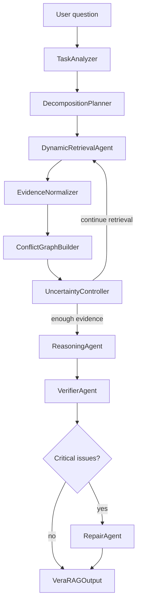

# Architecture

VeraRAG is built around one design constraint: the system should not only answer
with retrieved context, it should expose why the answer is supported, where the
evidence conflicts, and how uncertain the final answer is.

## High-Level Flow



The pipeline implementation lives in `src/pipeline/verarag.py`; the stable user
entry point is `verarag.VeraRAG`.

## Stage Responsibilities

| Stage | Component | Responsibility |
| --- | --- | --- |
| 1 | `TaskAnalyzer` | Classifies task type, complexity, keywords, retrieval need, and whether conflict checking is likely required. |
| 2 | `DecompositionPlanner` | Splits complex questions into subquestions and produces a reasoning plan. |
| 3 | `DynamicRetrievalAgent` | Runs multi-round retrieval, query expansion, and counter-evidence retrieval. |
| 4 | `EvidenceNormalizer` | Filters low-quality evidence, deduplicates spans, and keeps normalized `Evidence` objects. |
| 5 | `ConflictGraphBuilder` | Builds support/refutation/conflict edges among evidence claims. |
| 6 | `UncertaintyController` | Chooses whether to stop, continue retrieval, resolve conflicts, decompose further, abstain, or answer. |
| 7 | `ReasoningAgent` | Produces an answer, answer claims, and reasoning steps grounded in evidence. |
| 8 | `VerifierAgent` | Checks answer claims against retrieved evidence and the conflict graph. |
| 9 | `RepairAgent` | Revises overconfident, unsupported, or conflict-blind answers. |
| 10 | `VeraRAGOutput` | Returns answer, evidence, claims, conflict report, verification report, confidence, and metadata. |

## Evidence Model

VeraRAG normalizes retrieval results into `Evidence`:

- stable `evidence_id` for citation and evaluation;
- `source`, `title`, optional `date`, `author`, and `url`;
- `text_span` used for reasoning and verification;
- extracted atomic `Claim` objects;
- credibility, recency, relevance, and combined quality scores.

The benchmark evaluator maps chunk-level IDs back to document-level gold
evidence, so retrieval IDs must remain stable across runs.

## Conflict Graph

The conflict graph explicitly models relationships between evidence and claims.
It distinguishes support edges from conflict edges so diagnostics do not inflate
conflict scores with ordinary agreement.

Conflict detection is layered:

1. Rule detectors for numeric, temporal, entity, source, definition, scope, and
   related conflicts.
2. NLI-based checks when local model dependencies are available.
3. LLM adjudication for cases that need semantic judgment.

The graph reports:

- `num_conflicts`;
- `num_supports`;
- `conflict_score`;
- edge-level type, confidence, rationale, severity, and resolver strategy.

## Uncertainty Control

Uncertainty is estimated before final reasoning and after verification. The
controller can decide to:

- continue retrieval;
- resolve conflicts;
- refine decomposition;
- abstain;
- answer with caveats;
- answer directly.

The final confidence is calibrated from evidence coverage, conflict level,
verification status, and the uncertainty breakdown. Evaluation reports include
ECE, Brier score, and per-bin calibration diagnostics.

## Evaluation Architecture

VeraBench contains:

- 57 Chinese corpus documents;
- 152 questions;
- six question types: single evidence, multi evidence, conflict, temporal,
  unanswerable, and misleading;
- expected evidence references, expected conflicts, and expected behavior.

`VeraBenchEvaluator` can run in three modes:

- demo mode: ground truth self-evaluation for plumbing checks;
- baseline mode: any `answer_fn(question) -> answer`;
- pipeline mode: real VeraRAG runs through a `pipeline_factory`.

Reports include answer metrics, evidence recall/precision, conflict F1, behavior
accuracy, confidence calibration, failure summaries, conflict TP/FP/FN, and
behavior confusion matrices.

## Runtime Surfaces

VeraRAG exposes four primary runtime surfaces:

- Python API: `from verarag import VeraRAG, load_verabench`.
- Web UI: `verarag-web --port 8000`.
- Benchmark CLI: `verarag-benchmark --demo`.
- Offline diagnostics: `verarag-analyze` and `verarag-calibration`.

## Degradation Behavior

The project is designed to remain usable without every heavy dependency:

- If `sentence-transformers` or FAISS are missing, retrieval falls back to BM25.
- Demo benchmark mode needs no API key.
- Web demo mode can preview the flow without a configured LLM.
- Real pipeline quality still depends on a configured LLM provider and, for best
  retrieval quality, dense retrieval dependencies.

## Extension Points

Useful extension points for contributors:

- Add a retriever under `src/retriever/` and wire it through pipeline config.
- Add a conflict detector in `src/evidence/conflict_graph.py`.
- Add evaluation metrics under `src/evaluation/`.
- Add benchmark questions to `data/verabench/questions.jsonl` and package data
  under `src/benchmark/data/verabench/`.
- Add Web API/UI behavior under `web/`, keeping `tests/test_web_api.py` and
  `tests/test_web_db.py` aligned.

## Quality Gates

Before publishing or opening a PR, run:

```bash
make lint
python -m pytest tests -q
python -m build --sdist --wheel --no-isolation
```

The release package should include VeraBench data, Web templates/static files,
configs, `py.typed`, and the public `verarag` package.
