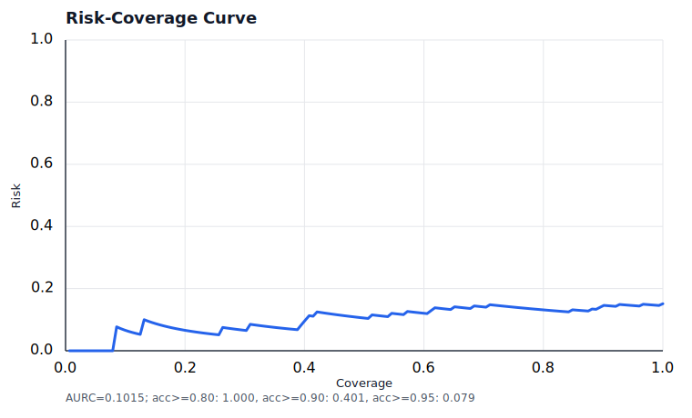
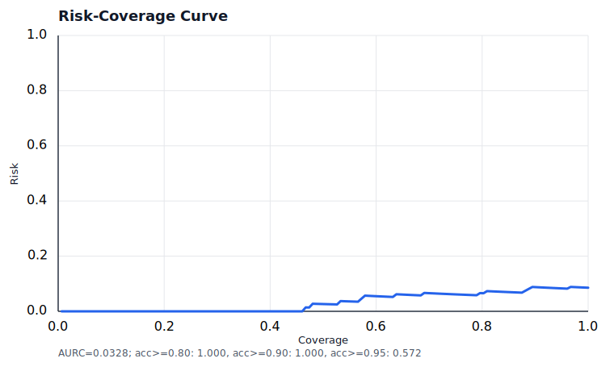

# VeraBench Results

> Compatibility note: VeraBench v1.1 changes the question ontology, gold
> conflicts, difficulty labels, and metric versions. VeraBench v1.1.1 then
> clarifies V084's time scope; v1.1.2 repairs evidence-span traceability without
> changing labels or metrics. v1.0 and v1.1 rows are historical and must not be
> compared directly with v1.1.2 runs unless explicitly labeled.

This file is generated from saved `run_verabench.py --output` JSON reports.
Commit raw result JSON files only when intentionally publishing a reproducibility artifact; otherwise keep them in ignored `results/` and regenerate this summary.

Generation command:

```bash
python experiments/build_verabench_leaderboard.py \
  results/verabench_full.json \
  results/verabench_full_v2.json \
  results/verabench_full_v3.json \
  --allow-unverified \
  --allow-mixed-benchmarks \
  --output docs/RESULTS.md
```

The override flags above are required because this file intentionally preserves
legacy, non-comparable historical runs. New formal leaderboards should omit
them and use only complete reports with matching benchmark and metric
fingerprints.

## VeraBench v1.1.2 Canonical Full Run

Current repository data is VeraBench v1.1.2:

- Corpus SHA-256:
  `bb99ce4d8b4ba7ee5a938595c7c786a8ad33601e4f096bec1bed844c43b6a8f3`
- Questions SHA-256:
  `c19e7401cbcd2526fb1e085c911d61095c8ce5bd19a664c13698a08024436882`

The canonical v1.1.2 full run is fixed in
`configs/verabench_v112_canonical.yaml`: DeepSeek `deepseek-v4-flash`,
temperature `0.0`, `max_tokens=4000`, BM25 retrieval,
`max_retrieval_rounds=1`, all verification/conflict/uncertainty/repair stages
enabled, and statistical intervals using 2,000 bootstrap resamples with seed
`1729`. Its authoritative artifact path is
`outputs/remote_results/verabench_v112_canonical_deepseek.json`.

```bash
DEEPSEEK_API_KEY=<key> verarag-benchmark \
  --config configs/verabench_v112_canonical.yaml \
  --output outputs/remote_results/verabench_v112_canonical_deepseek.json \
  --restart
```

The current canonical run completed on 2026-06-20 with 152/152 questions and
zero errors. It is the first v1.1.2 flagship result and replaces the historical
v1.0/v1.1 numbers for current claims. Earlier v1.1.2 targeted rerun commands
for V036/V048/V084 are now provenance for the repair path only; the full
canonical run below is the current authority.

| Metric | Estimate | Stratified 95% CI | Evidence-cluster 95% CI |
| --- | ---: | ---: | ---: |
| Behavior Accuracy | 0.9934 | [0.9803, 1.0000] | [0.9786, 1.0000] |
| Answer F1 (`soft-f1-v2`) | 0.4031 | [0.3707, 0.4354] | [0.3683, 0.4386] |
| Evidence Precision | 0.1244 | [0.1167, 0.1326] | [0.1106, 0.1362] |
| Evidence Recall | 0.9485 | [0.9254, 0.9704] | [0.9141, 0.9803] |
| Conflict micro-F1 | 0.5385 | [0.4091, 0.6565] | [0.3077, 0.7097] |
| Premise-refutation F1 | 0.9195 | [0.8605, 0.9737] | [0.8363, 0.9703] |
| Citation F1 | 0.0491 | [0.0175, 0.0855] | [0.0207, 0.0797] |
| Supporting-fact F1 | 0.7348 | [0.6833, 0.7880] | [0.6673, 0.7949] |
| ECE | 0.4742 | [0.4186, 0.5238] | [0.4094, 0.5294] |
| Brier Score | 0.3561 | [0.3310, 0.3797] | [0.3239, 0.3801] |
| Avg latency | 168.47s | [87.08s, 313.78s] | [85.45s, 339.56s] |

By question type, Behavior Accuracy is `1.0000` for single-evidence,
multi-evidence, conflict, temporal, and unanswerable rows, and `0.9730` for
misleading rows. The remaining behavior failure is one misleading-premise row
where the system abstains instead of correcting the premise. Conflict detection
is still over-detecting: TP/FP/FN is `14/23/1`, precision/recall is
`0.3784/0.9333`, and the dominant failure mode is `over_detection`.

Run provenance:

- Report: `outputs/remote_results/verabench_v112_canonical_deepseek.json`
- Benchmark version: `1.1.2`
- Metric versions: answer `soft-f1-v2`, behavior `behavior-v2`, conflict
  `gold-evidence-pair-micro-f1-v2`
- Git commit recorded by the report: `6803e9f`
- Implementation SHA-256:
  `f724d043f189509a71a1b5f1eddf45f1ab26d711e660dc493efb334236b5bbd3`
- Config SHA-256:
  `9877c7f8e7363991485cecb3977adf141a0567692b6ec26ac785a75abc097622`

## VeraBench v1.1.2 Stage-3 Retrieval A/B

The BM25+Reranker top-3 adaptive candidate completed the same 152-question
DeepSeek run with zero errors and is compared against the canonical report in
`outputs/remote_results/verabench_v112_retrieval_rerank_top3_deepseek_vs_canonical.md`.

| Metric | Direction | Canonical BM25 fixed | BM25+Reranker top-3 adaptive | Delta | 95% delta CI | P(candidate better) |
| --- | --- | ---: | ---: | ---: | ---: | ---: |
| Evidence Precision | higher | 0.1244 | 0.4934 | +0.3690 | [+0.3439, +0.3947] | 1.000 |
| Evidence Recall | higher | 0.9485 | 0.8827 | -0.0658 | [-0.0954, -0.0395] | 0.000 |
| Answer F1 | higher | 0.4031 | 0.4052 | +0.0022 | [-0.0230, +0.0274] | 0.567 |
| Behavior Accuracy | higher | 0.9934 | 0.9934 | +0.0000 | [-0.0197, +0.0197] | 0.337 |
| Conflict micro-F1 | higher | 0.5385 | 0.5641 | +0.0256 | [-0.1111, +0.1604] | 0.673 |
| Citation F1 | higher | 0.0491 | 0.0066 | -0.0425 | [-0.0811, -0.0066] | 0.006 |
| Supporting-fact F1 | higher | 0.7348 | 0.7070 | -0.0278 | [-0.0708, +0.0126] | 0.091 |
| ECE | lower | 0.4742 | 0.5075 | +0.0333 | [-0.0173, +0.0867] | 0.101 |
| Brier Score | lower | 0.3561 | 0.3967 | +0.0406 | [+0.0151, +0.0662] | 0.001 |
| Avg latency | lower | 168.47s | 17.57s | -150.90s | [-295.27s, -69.14s] | 1.000 |

The A/B result is precision-first but not yet a safe canonical replacement.
It clears the Evidence Precision target and cuts latency sharply, but it
significantly reduces Evidence Recall and citation quality and worsens Brier
score. Keep canonical BM25 fixed-depth as the default until the reranked path
adds recall/citation safeguards.

A guarded follow-up config,
`configs/verabench_v112_retrieval_rerank_top3_guarded.yaml`, now records both
`retriever_reranker_preserve_base_top_k=1` and
`reasoning_enforce_answer_citations=true` in new reports. On the three-question
DeepSeek smoke (`V001`, `V017`, `V041`), it keeps Evidence Recall and Behavior
Accuracy at `1.0000`, improves Evidence Precision from `0.1667` to `0.8333`,
improves Citation F1 from `0.0000` to `1.0000`, improves Answer F1 from
`0.5382` to `0.6914`, preserves Supporting-Fact F1 at `1.0000`, improves Brier
from `0.4140` to `0.4040`, and cuts mean latency from `57.58s` to `13.92s`
versus the canonical smoke. A question-aware NLI pruning guard removes
same-polarity law-status false positives for ordinary status questions while
preserving premise-check cross-evidence conflicts; a point-in-time value guard
also filters early-version evidence when an exact current-value answer drifts
into historical digressions. The guarded three-question smoke now clears its
launch gate, but it remains too small for promotion.

The broader 18-question guarded gate in
`configs/verabench_v112_guarded_gate18_ids.txt` is a stronger launch gate before
another full run. Top-3 guarded BM25+Reranker keeps Behavior Accuracy at
`1.0000`, improves Evidence Precision from `0.1760` to `0.5463`, Citation F1
from `0.2111` to `0.6593`, and mean latency from `127.44s` to `15.75s` versus
the canonical gate subset. It is still rejected for full-run promotion because
Evidence Recall drops from `0.9722` to `0.6944`, Supporting-Fact F1 drops from
`0.7856` to `0.6278`, and Brier worsens from `0.3236` to `0.3756`. A naive
expanded-depth variant,
`configs/verabench_v112_retrieval_rerank_expanded_guarded.yaml`, is also
rejected on the same gate: Behavior Accuracy falls to `0.9444`, Answer F1 falls
to `0.3336`, and Evidence Recall does not improve. The next candidate should
use targeted second-pass retrieval for low-coverage multi-evidence/temporal/
conflict rows instead of global top-k expansion.

The targeted second-pass candidate,
`configs/verabench_v112_retrieval_rerank_targeted_guarded.yaml`, keeps the
top-3 guarded first pass and appends at most two extra chunks only for
under-covered medium/complex retrieval needs. It now also enables
`reasoning.claim_slot_selection_enabled`, which compresses the reasoning prompt
to the strongest answer evidence slots while retaining the full evidence pool
for verification and scoring. It also adds narrow answer guards for simple
numeric answers, abstention conflict preambles, and premise-verification
answers that repeat unreliable reports without correcting them. On gate18 it
improves over top-3 guarded on Answer F1 (`0.4102` to `0.4362`), Evidence
Recall (`0.6944` to `0.7407`), Evidence Precision (`0.5463` to `0.5583`), and
correctness accuracy (`0.7222` to `0.8889`) while keeping Behavior Accuracy at
`1.0000`. It is still held back because Citation F1 (`0.6593` to `0.6204`),
Supporting-Fact F1 (`0.6278` to `0.5889`), latency (`15.75s` to `21.58s`),
ECE (`0.4334` to `0.5375`), and Brier (`0.3756` to `0.4070`) regress versus
top-3 guarded. The pipeline now applies a post-guard
`citation_support_sync` step after repair and deterministic answer guards: it
adds valid in-pool answer citations to claim-level supporting evidence, appends
missing claim support IDs back to the answer when citation enforcement is
enabled, and drops out-of-pool support IDs before final confidence is
estimated. This makes the guarded answer/citation/supporting-fact contract
auditable. The targeted guarded config also enables runtime behavior-prior
confidence calibration, blending the fused runtime confidence with conservative
behavior-level priors before the existing failure-mode caps and uncertainty
penalty.

The calibrated targeted gate18 rerun completed 18/18 questions with zero
errors at
`outputs/remote_results/verabench_v112_retrieval_rerank_targeted_calibrated_gate18.json`.
Compared with top-3 guarded, it improves Answer F1 (`0.4102` to `0.4420`),
Evidence Recall (`0.6944` to `0.7963`), Evidence Precision (`0.5463` to
`0.5861`), Citation F1 (`0.6593` to `0.6855`), Supporting-Fact F1 (`0.6278` to
`0.6352`), correctness accuracy (`0.7222` to `0.8333`), and Brier (`0.3756` to
`0.2978`) while keeping Behavior Accuracy at `1.0000`. Compared with the
previous targeted gate, calibration and citation/support sync improve ECE
(`0.5375` to `0.3803`) and Brier (`0.4070` to `0.2978`), but correctness drops
from `0.8889` to `0.8333` due to two generated-answer regressions (`V020`,
`V081`). Compared with canonical BM25 gate18, the candidate is much faster and
has higher Evidence Precision and Citation F1, but Evidence Recall and
Supporting-Fact F1 remain lower. This makes it a better Stage-3 candidate than
top-3 guarded, not yet a canonical replacement.

A focused stability smoke for the two calibrated regressions now passes:
`outputs/remote_results/verabench_v112_retrieval_rerank_targeted_stability_v020_v081.json`
completed `V020` and `V081` with `2/2` correct answers, zero errors, Evidence
Recall `1.0000`, Behavior Accuracy `1.0000`, and Conflict F1 `1.0000`.
`V020` uses a current-attribute retrieval refresh plus a narrow company
attribute conflict guard, while `V081` uses evidence-detail completion for
omitted process-node and advanced-packaging constraints. This is a targeted
smoke result only; promotion still requires another gate18 and then a full
152-question A/B.

The post-stability gate18 rerun,
`outputs/remote_results/verabench_v112_retrieval_rerank_targeted_stabilized_gate18.json`,
completed 18/18 questions with zero errors. Against top-3 guarded it improves
Answer F1 (`0.4102` to `0.4597`), Evidence Recall (`0.6944` to `0.7963`),
Evidence Precision (`0.5463` to `0.5833`), Citation F1 (`0.6593` to
`0.7741`), Supporting-Fact F1 (`0.6278` to `0.7333`), Conflict F1 (`0.7273`
to `1.0000`), correctness accuracy (`0.7222` to `0.9444`), and Brier
(`0.3756` to `0.3175`) while preserving Behavior Accuracy at `1.0000`.
Against the immediately prior calibrated gate it improves Answer F1, Citation
F1, Supporting-Fact F1, Conflict F1, and correctness, but ECE regresses
(`0.3803` to `0.4937`) and Brier worsens (`0.2978` to `0.3175`). The stabilized
candidate now passes gate18 for a full 152-question A/B, with calibration and
premise-refutation diagnostics flagged as watch items.

The full behavior-stabilized targeted run completed 152/152 questions with
zero errors at
`outputs/remote_results/verabench_v112_retrieval_rerank_targeted_stabilized_behavior_full.json`.
It uses the same targeted guarded config plus the V020/V081 stability fixes and
the premise/implication behavior guards. The report scores Behavior Accuracy
`0.9934`, Answer F1 `0.4216`, Evidence Recall/Precision `0.9079/0.4583`,
Citation F1 `0.7604`, Supporting-Fact F1 `0.7161`, Conflict micro-F1 `0.6667`,
ECE/Brier `0.3800/0.2763`, and mean latency `25.24s`. Compared with canonical
BM25 full, the paired A/B improves Answer F1 by `+0.0185`, Evidence Precision
by `+0.3339`, Citation F1 by `+0.7113`, Conflict micro-F1 by `+0.1282`, ECE by
`-0.0941`, Brier by `-0.0798`, and latency by `-143.23s`, while Evidence
Recall drops by `-0.0406` and Supporting-Fact Recall drops by `-0.0351`.
Compared with top-3 BM25+Reranker full, it recovers Evidence Recall by
`+0.0252`, Citation F1 by `+0.7539`, Supporting-Fact F1 by `+0.0091`, ECE by
`-0.1274`, and Brier by `-0.1205`; the cost is Evidence Precision `-0.0351`
and latency `+7.67s`.

The full-run failure audit is now concentrated enough to guide the next
iteration: the only behavior failure is `V026`, where the system abstains on a
current-CTO temporal question; low non-abstain evidence recall remains on
`V095` and `V116`; conflict scoring still over-detects 13 false-positive pairs
across multi-evidence/misleading rows and misses the `V122` self-conflict
pair. The paired comparison artifacts are
`outputs/remote_results/verabench_v112_retrieval_rerank_targeted_stabilized_behavior_full_vs_canonical.md`
and
`outputs/remote_results/verabench_v112_retrieval_rerank_targeted_stabilized_behavior_full_vs_top3.md`.

After that full-run audit, a targeted current-role temporal fix was validated
on `V026` at
`outputs/remote_results/verabench_v112_retrieval_rerank_targeted_role_transition_v026.json`.
The one-row smoke retrieves both `D012` and `D011`, answers with the new CTO
appointment and prior CTO departure, and scores Behavior Accuracy `1.0000`,
Answer F1 `0.5106`, Evidence Recall `1.0000`, and zero conflict failures. This
is a targeted regression result only; the next full run should verify whether
the full 152-row behavior accuracy reaches `1.0000` without new regressions.

The next post-full repair targets the two low-recall non-abstain rows, `V095`
and `V116`, with aspect-coverage retrieval refresh. The retriever now recognizes
broad multi-aspect questions, uses a complex evidence budget for the second
pass, and expands carbon-emissions premise questions toward real mitigation
actions while expanding quantum-application questions toward both application
and maturity evidence. The pipeline also filters the NLI false positive between
emissions-level facts and mitigation-progress facts. The focused report
`outputs/remote_results/verabench_v112_retrieval_rerank_targeted_aspect_refresh_v095_v116.json`
scores 2/2 completed with zero errors, Behavior Accuracy `1.0000`, Answer F1
`0.3601`, Evidence Recall `1.0000`, Evidence Precision `0.6000`, and zero
conflict failures. `V116` still has incomplete citation/support coverage for
the IBM roadmap evidence, so this is a retrieval/conflict regression smoke
rather than a full answer-quality closure.

### Stage-3 Post-hoc Calibration Diagnostic

The behavior-stabilized targeted full report was also calibrated offline with
held-out Platt scaling:

```bash
python experiments/calibrate_verabench_confidence.py \
  --input outputs/remote_results/verabench_v112_retrieval_rerank_targeted_stabilized_behavior_full.json \
  --output outputs/remote_results/verabench_v112_retrieval_rerank_targeted_stabilized_behavior_full_posthoc_platt.json \
  --summary-output outputs/remote_results/verabench_v112_retrieval_rerank_targeted_stabilized_behavior_full_posthoc_platt_summary.json \
  --method platt \
  --seed 1729 \
  --json
```

This is a diagnostic calibrated copy, not a replacement for the uncalibrated
runtime report. It shows the probability scale is now recoverable from saved
rows: all-row ECE/Brier improve from `0.3800/0.2763` to `0.0164/0.1270`; on
the deterministic holdout split, ECE/Brier improve from `0.3902/0.2816` to
`0.0301/0.1260`. Temperature scaling was much weaker (`0.3503` all-row ECE
after calibration). Behavior-grouped Platt improves all-row Brier further to
`0.1161`, but most behavior groups fall back to smoothed constants because
their calibration splits are sparse or single-class.

The ranking signal still needs work: confidence AUROC remains `0.6112`, and
because Platt scaling is monotonic, AURC stays `0.1015` with
coverage@accuracy≥0.90 at `0.4013` and coverage@accuracy≥0.95 at `0.0789`.
That separates the stage-2 problem cleanly: post-hoc calibration fixes the
probability scale, while future runtime confidence work must improve
correct/incorrect ranking.



Curve points are archived in
[`assets/verabench_v112_stage3_stabilized_posthoc_platt_risk_coverage.csv`](assets/verabench_v112_stage3_stabilized_posthoc_platt_risk_coverage.csv).

## VeraBench v1.1.2 Conflict CrossEncoder Negative Result

The learned conflict detector is not enabled by default. On 2026-06-15, the
Windows GPU matrix workflow reproduced the current three-seed negative result
with `scripts/start_windows_conflict_training_matrix.sh`:

| Seed | Selected threshold | Validation F1 | Test precision | Test recall | Test F1 |
| ---: | ---: | ---: | ---: | ---: | ---: |
| 13 | 0.336 | 0.667 | 0.188 | 1.000 | 0.316 |
| 17 | 0.604 | 0.333 | 0.000 | 0.000 | 0.000 |
| 23 | 0.302 | 0.400 | 0.188 | 1.000 | 0.316 |

On 2026-06-20, a precision-first threshold matrix
(`VERARAG_GPU_THRESHOLD_OBJECTIVE=precision`,
`VERARAG_GPU_MIN_THRESHOLD_PRECISION=1.0`) tested whether false positives could
be controlled without changing the pair dataset:

| Seed | Selected threshold | Validation P/R/F1 | Test P/R/F1 | Test TP / FP / FN |
| ---: | ---: | ---: | ---: | ---: |
| 13 | 0.769 | 1.000 / 0.333 / 0.500 | 0.333 / 0.667 / 0.444 | 2 / 4 / 1 |
| 17 | 0.604 | 0.333 / 0.333 / 0.333 | 0.000 / 0.000 / 0.000 | 0 / 3 / 3 |
| 23 | 0.302 | 0.286 / 0.667 / 0.400 | 0.188 / 1.000 / 0.316 | 3 / 13 / 0 |

The precision-first audit again rejected promotion. The best seed improved
from F1 `0.316` to `0.444`, but the three-seed result remains unstable and
still adds false positives in the held-out gold-evidence A/B.

The held-out gold-evidence detector A/B on the seed-13 model showed no gain:
rules and rules+learned both reached precision `0.750`, recall `1.000`, F1
`0.857`, and TP/FP/FN `3/1/0`. The report-only promotion audit rejected the
learned model on multi-seed test F1, dependency-robust lower bound, minimum
A/B sample size, and held-out improvement.

Current v1.1.2 gold-evidence rules-only diagnosis from
`compare_conflict_detectors.py` is more precise than the older F1≈0 summary.
After targeted deterministic fixes for self-pair conflicts (`V021`, `V075`,
`V122`) and V017 duplicate cross-evidence reporting, all 13 conflict-bearing
rows score precision `1.0000`, recall `1.0000`, F1 `1.0000` with TP/FP/FN
`15/0/0`; the dependency-aware test split also scores `3/0/0`. This is an edge
layer result on gold evidence, not yet an end-to-end LLM pipeline result.

## Historical VeraBench v1.1 Full Run

Merged from two compatible partition reports with:

```bash
python experiments/merge_verabench_reports.py \
  outputs/remote_results/verabench_v11_part_a.json \
  outputs/remote_results/verabench_v11_part_b.json \
  --require-complete \
  --output outputs/remote_results/verabench_v11_full_merged_rescored.json
```

| Run | Model | Questions | Errors | Behavior Acc | Answer F1 | Evidence Recall | Conflict micro-F1 | Conflict TP / FP / FN | ECE | Avg Latency |
| --- | --- | ---: | ---: | ---: | ---: | ---: | ---: | ---: | ---: | ---: |
| verabench_v11_full_merged_rescored | deepseek/deepseek-v4-flash | 152/152 | 0 | 0.980 | 0.459 | 0.952 | 0.897 | 13 / 1 / 2 | 0.563 | 32.1s |

Metric versions: `soft-f1-v2`, `behavior-v2`,
`gold-evidence-pair-micro-f1-v2`. Conflict scoring counts only predicted pairs
inside the question's gold evidence set; extra conflicts on retrieved distractor
documents are retained in diagnostics as unscored extraneous pairs.

### v1.1 Statistical Uncertainty

Offline rescoring with `stratified-question-bootstrap-v1` (2,000 resamples,
95% confidence, seed 1729) gives:

| Metric | Estimate | 95% interval |
| --- | ---: | ---: |
| Answer F1 | 0.459 | [0.431, 0.489] |
| Evidence Recall | 0.952 | [0.929, 0.974] |
| Behavior Accuracy | 0.980 | [0.954, 1.000] |
| Conflict micro-F1 | 0.897 | [0.700, 1.000] |
| Premise-refutation F1 | 0.976 | [0.937, 1.000] |
| ECE | 0.563 | [0.518, 0.606] |

The wide conflict interval reflects the small number of annotated conflict
pairs. Point estimates should not be used alone to claim superiority.

The same saved rows can be mapped by question ID to the current benchmark's 27
shared-evidence components. `evidence-cluster-bootstrap-v1` gives the following
dependency sensitivity intervals:

| Metric | Estimate | 95% cluster interval |
| --- | ---: | ---: |
| Answer F1 | 0.459 | [0.433, 0.488] |
| Evidence Recall | 0.952 | [0.916, 0.985] |
| Behavior Accuracy | 0.980 | [0.954, 1.000] |
| Conflict micro-F1 | 0.897 | [0.720, 1.000] |
| ECE | 0.563 | [0.502, 0.614] |
| Brier score | 0.403 | [0.370, 0.435] |

These are sensitivity estimates for evidence reuse, not retroactive proof that
the historical v1.1 run used the current v1.1.2 annotations.

### v1.1 Selective Prediction Diagnostic

The historical v1.1 rows were post-hoc calibrated with behavior-grouped Platt
scaling before drawing the selective-prediction curve. This diagnostic is not a
canonical v1.1.2 claim, but it demonstrates the ROADMAP stage-2 reporting path:
AURC `0.0328`, coverage@accuracy≥0.95 `0.572`, and coverage@accuracy≥0.90
`1.000`.



Curve points are archived in
[`assets/verabench_v11_group_calibrated_risk_coverage.csv`](assets/verabench_v11_group_calibrated_risk_coverage.csv).

### v1.1 By Type

| Type | Count | Answer F1 | Evidence Recall | Behavior Acc |
| --- | ---: | ---: | ---: | ---: |
| single_evidence | 27 | 0.622 | 1.000 | 1.000 |
| multi_evidence | 26 | 0.471 | 0.981 | 1.000 |
| conflict | 11 | 0.468 | 0.955 | 1.000 |
| temporal | 25 | 0.457 | 0.840 | 0.960 |
| unanswerable | 26 | 0.415 | 1.000 | 0.962 |
| misleading | 37 | 0.363 | 0.937 | 0.973 |

Residual behavior failures in this saved v1.1 run: V036 (unanswerable
hallucination), V048 (over-conservative abstention on a misleading premise),
and V084 (question text asked for 2024 data while gold evidence answered the
2023 additions available as of early 2024). Current code adds a deterministic
answerability guard for V036/V048, v1.1.1 clarifies V084, and v1.1.2 makes all
evidence spans machine-traceable;
the table above will be superseded after the next real DeepSeek rerun.

## Historical v1.0 Leaderboard

| Rank | Run | Model | Questions | Errors | Behavior Acc | Answer F1 | Evidence Recall | Conflict F1 | ECE | Avg Latency | Commit |
| ---: | --- | --- | ---: | ---: | ---: | ---: | ---: | ---: | ---: | ---: | --- |
| 1 | verabench_full_v3 | deepseek/deepseek-v4-flash | 152/152 | 0 | 0.763 | 0.281 | 0.799 | 0.006 | 0.416 | 61.7s | acb0b5f |
| 2 | verabench_full_v2 | deepseek/deepseek-v4-flash | 152/152 | 0 | 0.743 | 0.271 | 0.814 | 0.007 | 0.415 | 66.6s | acb0b5f |
| 3 | verabench_full | deepseek/deepseek-v4-flash | 152/152 | 0 | 0.526 | 0.157 | 0.811 | 0.007 | 0.062 | 79.2s | cc29ed2 |

## Focused Conflict Smoke

This v1.0 focused smoke is not a full leaderboard entry. It is a historical regression
check for conflict/misleading behavior using the offline-friendly
`configs/deepseek_rules_only.yaml` configuration.

| Run | Model | Questions | Errors | Behavior Acc | Answer F1 | Evidence Recall | Conflict F1 | Conflict TP / FP / FN | Result Path |
| --- | --- | ---: | ---: | ---: | ---: | ---: | ---: | ---: | --- |
| conflict_misleading_rules_only_max25_v5 | deepseek/deepseek-v4-flash | 25/25 | 0 | 0.960 | 0.240 | 1.000 | 0.640 | 18 / 0 / 2 | `outputs/remote_results/verabench_conflict_misleading_rules_only_max25_v5.json` |
| conflict_misleading_rules_only_max25_v3 | deepseek/deepseek-v4-flash | 25/25 | 0 | 0.960 | 0.249 | 1.000 | 0.640 | 18 / 0 / 2 | `outputs/remote_results/verabench_conflict_misleading_rules_only_max25_v3.json` |
| conflict_misleading_rules_only_max25_v2 | deepseek/deepseek-v4-flash | 25/25 | 0 | 0.960 | 0.301 | 1.000 | 0.640 | 18 / 0 / 2 | `outputs/remote_results/verabench_conflict_misleading_rules_only_max25_v2.json` |
| conflict_misleading_rules_only_max10_v16 | deepseek/deepseek-v4-flash | 10/10 | 0 | 1.000 | 0.344 | 1.000 | 1.000 | 12 / 0 / 0 | `outputs/remote_results/verabench_conflict_misleading_rules_only_max10_v16.json` |

For `conflict_misleading_rules_only_max25_v5`, `premise_refutation_summary`
reports TP/FP/FN `17/0/0`, precision `1.0000`, and recall `1.0000`. The two
remaining conflict false negatives (`V067`, `V068`) motivated the v1.1
ontology correction: these are premise refutations rather than
evidence-evidence contradictions.

## Best Run By Type: verabench_full_v3 (deepseek/deepseek-v4-flash)

| Type | Count | Answer F1 | Evidence Recall | Behavior Acc |
| --- | ---: | ---: | ---: | ---: |
| conflict | 25 | 0.256 | 0.720 | 0.480 |
| misleading | 25 | 0.181 | 0.867 | 0.760 |
| multi_evidence | 25 | 0.262 | 0.713 | 0.600 |
| single_evidence | 26 | 0.331 | 1.000 | 1.000 |
| temporal | 25 | 0.330 | 0.640 | 0.760 |
| unanswerable | 26 | 0.324 | 0.846 | 0.962 |

## Reproducibility Metadata

| Run | Provider | Model | Config | Timestamp | Result Path |
| --- | --- | --- | --- | --- | --- |
| verabench_full_v3 | deepseek | deepseek-v4-flash | configs/deepseek_run.yaml | 2026-06-01T15:44:53+0800 | `results/verabench_full_v3.json` |
| verabench_full_v2 | deepseek | deepseek-v4-flash | configs/deepseek_run.yaml | 2026-06-01T12:03:39+0800 | `results/verabench_full_v2.json` |
| verabench_full | deepseek | deepseek-v4-flash | configs/deepseek_run.yaml | 2026-06-01T00:24:58+0800 | `results/verabench_full.json` |
